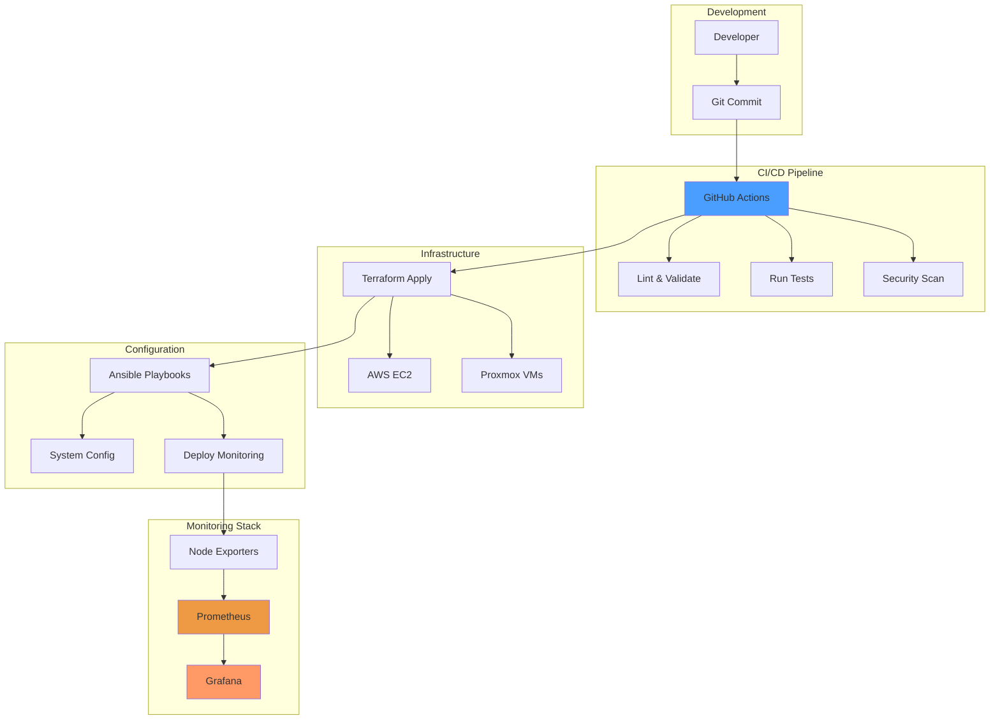

# Homelab DevOps Portfolio

[](https://github.com/iso-st3ph/homelab-devops/actions/workflows/ci.yml)
[](https://github.com/iso-st3ph/homelab-devops/actions/workflows/infra-ci.yml)
[](https://devops.ayoskip.info/)


**Live Documentation:** <https://devops.ayoskip.info/>

A production-ready DevOps portfolio showcasing **infrastructure automation, monitoring, and orchestration** in a real homelab environment.  
Built with **Ansible, Terraform, Docker, Prometheus, and GitHub Actions** — the same tools used in enterprise DevOps.

---

## 🎯 What This Demonstrates

- ✅ **Infrastructure as Code** (Terraform modules with testing)
- ✅ **Configuration Management** (Ansible roles and playbooks)
- ✅ **Production Observability** (Prometheus + Grafana + AlertManager + Slack)
- ✅ **Full Observability Stack** (Metrics + Logs + Traces)
- ✅ **Kubernetes Orchestration** (K3s cluster with monitoring stack)
- ✅ **GitOps Methodology** (ArgoCD declarative deployment and sync)
- ✅ **Jenkins CI/CD** (Kubernetes-based with dynamic agent provisioning)
- ✅ **Image Automation** (Packer for hardened AMI builds)
- ✅ **Container Orchestration** (Docker Compose services)
- ✅ **CI/CD Automation** (GitHub Actions + pre-commit hooks)
- ✅ **Container Security** (Trivy vulnerability scanning in CI/CD)
- ✅ **Dashboard Automation** (4 pre-built Grafana dashboards auto-provisioned)
- ✅ **Log Aggregation** (Loki + Promtail with 30-day retention)
- ✅ **Distributed Tracing** (Tempo with trace correlation)
- ✅ **Secrets Management** (Ansible Vault encryption)
- ✅ **Multi-Environment Management** (dev/staging/prod with Terraform workspaces)
- ✅ **Security Hardening** (SELinux, systemd protections, firewall automation)
- ✅ **Disaster Recovery** (Automated backup/restore procedures)
- ✅ **Documentation as Code** (MkDocs with Mermaid diagrams)

---

## 🧠 Tech Stack

| Category | Technologies |
|----------|-------------|
| **Infrastructure** | Terraform, AWS EC2, Proxmox VMs |
| **Configuration** | Ansible, Ansible Vault, systemd, firewalld/ufw |
| **Monitoring** | Prometheus, Grafana, AlertManager, Node Exporter, cAdvisor |
| **Logging** | Loki, Promtail (30-day retention) |
| **Tracing** | Tempo (OTLP receivers, trace correlation) |
| **Orchestration** | Kubernetes (K3s), Docker, Docker Compose |
| **GitOps** | ArgoCD (declarative deployment, auto-sync, self-heal) |
| **Containers** | Docker, Docker Compose, Nginx |
| **CI/CD** | GitHub Actions, pre-commit, TFLint, Checkov, yamllint |
| **Security** | Trivy, Ansible Vault, SELinux, systemd hardening |
| **Documentation** | MkDocs Material, Mermaid diagrams |
| **Languages** | Python, Bash, YAML, HCL |

---

## 📁 Repository Structure

```
homelab-devops/
├── ansible/
│   ├── playbooks/
│   │   ├── deploy-monitoring.yml    # Deploy node_exporter to hosts
│   │   ├── patch.yml                # System updates
│   │   └── secure.yml               # Security hardening
│   ├── roles/
│   │   ├── common/                  # Base system configuration
│   │   ├── monitoring/              # Prometheus node_exporter role
│   │   │   ├── tasks/               # Installation & configuration
│   │   │   ├── templates/           # systemd service templates
│   │   │   ├── handlers/            # Service restart handlers
│   │   │   └── README.md            # Role documentation
│   │   └── secure/                  # Security hardening role
│   └── inventories/                 # Host inventory files
│
├── docker/
│   ├── monitoring-stack/            # Prometheus + Grafana stack
│   │   ├── docker-compose.yml       # Container orchestration
│   │   ├── prometheus/              # Metrics collection config
│   │   ├── grafana/                 # Visualization platform
│   │   └── README.md                # Setup guide
│   └── reverse-proxy/               # Nginx reverse proxy
│
├── terraform/
│   ├── aws-ec2/                     # AWS infrastructure
│   │   ├── main.tf                  # EC2 instance configuration
│   │   ├── variables.tf             # Input variables
│   │   └── outputs.tf               # Output values
│   └── modules/
│       └── ec2_minimal/             # Reusable EC2 module
│           ├── main.tf              # Module logic
│           └── tests/               # Terraform tests
│
├── scripts/
│   └── generate_prometheus_targets.py  # Auto-generate scrape configs
│
├── docs/                            # MkDocs documentation
│   ├── index.md                     # Portfolio homepage
│   ├── ansible.md                   # Automation guide
│   ├── terraform.md                 # Infrastructure guide
│   ├── monitoring.md                # Observability guide
│   └── architecture.md              # System architecture
│
├── .github/workflows/
│   ├── ci.yml                       # Main CI pipeline
│   ├── infra-ci.yml                 # Infrastructure validation
│   └── docs.yml                     # Documentation deployment
│
├── Makefile                         # Common automation tasks
└── mkdocs.yml                       # Documentation configuration
```

---

## 🚀 Quick Start

### 1. Monitoring Stack (Prometheus + Grafana)

Deploy a complete observability stack in minutes:

```bash
# Start monitoring services
make mon-up

# Access services
# Grafana:    http://localhost:3001 (admin / see .env)
# Prometheus: http://localhost:9090
# cAdvisor:   http://localhost:8080
```

### 2. Deploy Node Exporter to Remote Hosts

Automate metrics collection across your infrastructure:

```bash
cd ansible
ansible-playbook playbooks/deploy-monitoring.yml

# Verify installation
ansible all -m uri -a "url=http://localhost:9100/metrics status_code=200"
```

### 3. Infrastructure Provisioning (Terraform)

Provision cloud infrastructure with automated testing:

```bash
cd terraform/aws-ec2
terraform init
terraform plan
terraform apply

# Run module tests
cd ../modules/ec2_minimal
terraform test
```

### 4. System Patching (Ansible)

Automate OS updates across your fleet:

```bash
cd ansible
ansible-playbook playbooks/patch.yml --check --diff -K
```

---

## 🛠️ Key Features

### Monitoring & Observability

- **Prometheus** for metrics collection with 15-day retention
- **Grafana** for visualization with auto-provisioned datasources
- **Node Exporter** deployed via Ansible to all managed hosts
- **cAdvisor** for Docker container metrics
- SELinux/Fedora compatible configurations
- Automatic firewall management
- Health check verification

### Infrastructure as Code

- **Terraform modules** with built-in testing framework
- **AWS EC2** provisioning with IMDSv2, SSM, encrypted volumes
- **Reusable components** for consistent deployments
- **State management** best practices

### Configuration Management

- **Ansible roles** for repeatable configurations
- **Idempotent playbooks** safe to run multiple times
- **Dynamic inventory** support
- **Security hardening** with systemd protections
- **Firewall automation** (firewalld/ufw)

### CI/CD Pipeline

- **Multi-stage validation**: Terraform, Ansible, Docker, YAML
- **Security scanning**: Checkov for IaC vulnerabilities
- **Automated testing**: Terraform test framework
- **Documentation deployment**: Auto-publish to GitHub Pages
- **Pre-commit hooks**: Local validation before commits

---

## 📊 Architecture



---

## 🔍 Example Workflows

### End-to-End Monitoring Setup

```bash
# 1. Deploy infrastructure
cd terraform/aws-ec2
terraform apply -auto-approve

# 2. Configure hosts and deploy monitoring
cd ../../ansible
ansible-playbook playbooks/deploy-monitoring.yml

# 3. Generate Prometheus targets
python3 ../scripts/generate_prometheus_targets.py inventories/hosts

# 4. Start local monitoring stack
cd ..
make mon-up

# 5. Import Grafana dashboards
# Visit http://localhost:3001 → Import → Dashboard ID: 1860
```

### Infrastructure Testing

```bash
# Validate before deploy
make lint

# Test Terraform modules
make tf-test

# Check Ansible syntax
cd ansible
ansible-playbook playbooks/*.yml --syntax-check
```

---

## � Metrics & Monitoring

The monitoring stack collects:

- **System metrics**: CPU, memory, disk, network (via Node Exporter)
- **Container metrics**: Docker resource usage (via cAdvisor)
- **Service metrics**: Prometheus self-monitoring
- **Custom metrics**: Extensible with additional exporters
- **Logs**: Centralized log aggregation (via Loki + Promtail)
- **Traces**: Distributed tracing (via Tempo with OTLP)

**Auto-provisioned dashboards:**
- Node Exporter Full (ID: 1860) - Complete system monitoring
- Docker & System Monitoring (ID: 179) - Container resource overview
- cAdvisor Prometheus (ID: 893) - Deep container diagnostics
- Node Exporter Quickstart (ID: 15172) - Simplified health views

**Security scanning:**
- Trivy vulnerability scanner in CI/CD pipeline
- Scans 5 container images: Prometheus, Grafana, AlertManager, Node Exporter, cAdvisor
- Local scanning automation with `make security-scan`

**Observability Features:**
- 📈 **Metrics**: 15-day retention, auto-discovery, alerting rules
- 📝 **Logs**: 30-day retention, Docker container logs, query correlation
- 🔍 **Traces**: 30-day retention, service graphs, span metrics
- 🔗 **Correlation**: Unified view with trace→logs, trace→metrics linking

---

## 🧪 Testing

```bash
# Run all pre-commit hooks
make lint

# Terraform validation
cd terraform/modules/ec2_minimal
terraform init -backend=false
terraform test

# Ansible syntax check
cd ansible
ansible-playbook playbooks/deploy-monitoring.yml --syntax-check

# Docker Compose validation
docker compose -f docker/monitoring-stack/docker-compose.yml config
```

---

## 📚 Documentation

Comprehensive documentation is available at **<https://devops.ayoskip.info/>**

Topics covered:
- Architecture overview
- Terraform infrastructure guide
- Ansible automation patterns
- Monitoring & observability setup
- Docker container orchestration
- CI/CD pipeline details

Build docs locally:
```bash
make serve
# Visit http://localhost:8000
```

---

## 🎓 Skills Demonstrated

- **Infrastructure as Code**: Terraform modules, state management, testing
- **Configuration Management**: Ansible roles, playbooks, inventory management
- **Containerization**: Docker Compose, multi-container applications
- **Monitoring**: Prometheus, Grafana, metrics collection, dashboards
- **CI/CD**: GitHub Actions, automated testing, security scanning
- **Security**: SELinux, systemd hardening, firewall automation
- **Documentation**: MkDocs, Mermaid diagrams, technical writing
- **Linux Administration**: systemd, package management, service orchestration
- **Python**: Automation scripts, inventory parsing
- **Version Control**: Git workflows, pre-commit hooks

---

## 🛣️ Roadmap

### ✅ Completed (Phase 1 - Production Ready)
- [x] Terraform AWS EC2 module with testing
- [x] Ansible system patching playbook
- [x] Docker Compose reverse proxy
- [x] Prometheus + Grafana monitoring stack
- [x] Node Exporter Ansible role
- [x] CI/CD with GitHub Actions
- [x] MkDocs documentation site
- [x] **Prometheus AlertManager with Slack integration**
- [x] **Alert rules (CPU, memory, disk, services) with runbooks**
- [x] **Ansible Vault secrets management**
- [x] **Multi-environment Terraform (dev/staging/prod)**
- [x] **Automated backup/restore scripts**
- [x] **Security hardening (SELinux, firewall, systemd)**

### ✅ Completed (Phase 2 - Cloud Native)
- [x] **Container security scanning (Trivy in CI/CD)**
- [x] **Pre-built Grafana dashboards (4 production dashboards)**
  - Node Exporter Full (1860) - Complete system monitoring
  - Docker & System Monitoring (179) - Container overview
  - cAdvisor Prometheus (893) - Deep container metrics
  - Node Exporter Quickstart (15172) - Simplified views
- [x] **Log aggregation (Loki + Promtail)**
  - Centralized log storage with 30-day retention
  - Docker container log collection
  - Grafana datasource with log-to-trace correlation
- [x] **Distributed tracing (Tempo)**
  - OTLP receiver for traces (gRPC + HTTP)
  - Trace-to-logs and trace-to-metrics correlation
  - Service graphs and span metrics generation
  - 30-day trace retention with compaction

### ✅ Completed (Phase 3 - Kubernetes & GitOps)

- [x] **Kubernetes/K3s cluster deployment**
  - K3s v1.33.5+k3s1 lightweight Kubernetes
  - Complete monitoring stack on Kubernetes (5 services)
  - Prometheus with K8s service discovery and RBAC
  - Grafana with auto-provisioned datasources
  - Loki and Tempo for logs and traces
  - AlertManager with routing rules
  - PersistentVolumeClaims for data persistence (50Gi total)
  - Health checks, resource limits, and NodePort services
  - Deployment automation with kubectl manifests

- [x] **GitOps with ArgoCD**
  - ArgoCD v2.x installed on K3s cluster
  - Declarative application management from Git repository
  - Automated sync with self-heal and prune capabilities
  - AppProject RBAC with admin/developer roles
  - Managing monitoring stack deployments via GitOps
  - 3-minute auto-sync polling with retry logic
  - Sync waves and hooks for controlled deployments
  - Complete audit trail via Git history
  - Comprehensive documentation and operational guides

- [x] **Jenkins CI/CD on Kubernetes**
  - Jenkins LTS deployed on K3s cluster
  - Dynamic Kubernetes agent provisioning (max 10 concurrent)
  - Jenkins Configuration as Code (JCasC) for zero-touch setup
  - Multi-stage declarative pipeline with specialized containers
  - Terraform validation and module testing
  - Ansible playbook syntax checking
  - Trivy security scanning (IaC + container images)
  - kubectl dry-run validation for K8s manifests
  - RBAC with dedicated ServiceAccount and ClusterRole
  - 20Gi persistent storage for jenkins_home
  - NodePort access on port 30808
  - ArgoCD Application for GitOps management
  - Automated deployment scripts and Makefile targets

- [x] **Packer Image Builds**
  - HashiCorp Packer templates for Ubuntu 22.04 LTS
  - Multi-stage provisioning (update, packages, security, monitoring, Docker, cleanup)
  - Security hardening (SSH, UFW firewall, fail2ban, kernel tuning, ClamAV, AIDE)
  - AWS integration (CLI v2, SSM Agent, CloudWatch Agent)
  - Monitoring tools pre-installed (Node Exporter, Promtail)
  - Docker Engine and Compose with daemon hardening
  - Automated cleanup (logs, temp files, SSH keys, machine-id)
  - IMDSv2 enforcement and EBS encryption
  - Build automation scripts and Makefile targets
  - Terraform integration for immutable infrastructure

### 🎉 Phase 3 Complete!

All Phase 3 tasks successfully implemented:
- ✅ K3s Kubernetes cluster with full monitoring stack (5 services)
- ✅ ArgoCD GitOps platform managing 2 applications
- ✅ Jenkins CI/CD with Kubernetes dynamic agents
- ✅ Packer automated image builds with security hardening

**Total Infrastructure**:
- 13 Kubernetes pods across 3 namespaces
- 70Gi persistent storage (monitoring + Jenkins)
- 2 ArgoCD Applications (monitoring-stack, jenkins)
- GitOps workflow with auto-sync and self-heal
- Multi-stage CI/CD pipeline with security scanning
- Hardened AMI template for AWS deployments

### 📋 Future Enhancements

- [ ] Helm charts for Kubernetes applications
- [ ] HashiCorp Vault integration
- [ ] Service mesh (deferred - K8s v1.33 compatibility)

---

## 👨‍💻 Author

**Stephon Skipper**  
DevOps Engineer | Infrastructure Automation | Cloud & Homelab Enthusiast

- 🌐 Website: <https://ayoskip.info>
- 💼 LinkedIn: <https://www.linkedin.com/in/stephon-skipper/>
- 📂 Portfolio: <https://devops.ayoskip.info/>

---

## 🤝 Contributing

While this is a personal portfolio project, suggestions and feedback are welcome!

- Open an issue for bugs or feature requests
- Star ⭐ this repo if you find it useful
- Fork and adapt for your own homelab

---

## 📄 License

This project is open source and available under the [MIT License](LICENSE).

---

## 🙏 Acknowledgments

Built with:
- [Terraform](https://www.terraform.io/) - Infrastructure as Code
- [Ansible](https://www.ansible.com/) - Configuration Management
- [Prometheus](https://prometheus.io/) - Metrics & Monitoring
- [Grafana](https://grafana.com/) - Visualization Platform
- [Docker](https://www.docker.com/) - Containerization
- [MkDocs Material](https://squidfunk.github.io/mkdocs-material/) - Documentation

---

**⚡ This homelab demonstrates production-ready DevOps practices in a real-world environment.**

<!-- # homelab-devops
_A practical DevOps portfolio built from a real homelab environment._ -->


[](https://github.com/iso-st3ph/homelab-devops/actions/workflows/infra-ci.yml)
[](https://github.com/iso-st3ph/homelab-devops/actions/workflows/docs.yml)


This repository showcases **automation and infrastructure management** for my personal homelab.  
It demonstrates real-world experience using **Ansible, Terraform, Docker, and GitHub Actions** — the same tools used in modern DevOps environments.

---

## 📚 Table of Contents
- [🧠 Tech Stack](#-tech-stack)
- [📁 Repository Structure](#-repository-structure)
- [🚀 Quickstart](#-quickstart)
- [🛠️ Roadmap](#️-roadmap)
- [👨‍💻 Author](#-author)

---

## 🧠 Tech Stack
- **Linux / Fedora / Ubuntu**
- **Ansible** – system automation and patch management  
- **Terraform** – infrastructure as code (AWS + Proxmox examples)  
- **Docker Compose** – lightweight service orchestration  
- **GitHub Actions** – CI/CD automation and syntax validation  
- **AWS** – cloud infrastructure provisioning  

---

## 📁 Repository Structure

---

## 🚀 Quickstart

### Ansible

cd ansible
ansible-playbook playbooks/patch.yml --check --diff -K

---

## 🤝 Contributing / Contact
Questions or ideas? Open an Issue or reach out:

- **LinkedIn:** <https://www.linkedin.com/in/stephon-skipper/>
- **Site:** <https://ayoskip.info>

If this repo helped you, ⭐ it and follow along as I add Jenkins, Packer, Grafana/Prometheus, and Proxmox automation.

### CI/CD
- **GitHub Actions**: default CI (syntax/validate)
- **Jenkins**: `Jenkinsfile` mirrors the same checks for enterprise environments

## What’s inside
- **IaC:** Terraform (EC2 module with IMDSv2, SSM, encrypted volumes)
- **Config:** Ansible baseline role
- **Containers:** Reverse proxy demo
- **CI:** pre-commit, TFLint, Checkov, Hadolint, Ansible-lint, Terraform tests
- **Docs:** MkDocs Material → https://iso-st3ph.github.io/homelab-devops/
