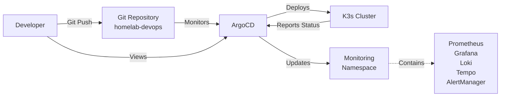

# ArgoCD GitOps Setup

This directory contains ArgoCD configurations for declarative, GitOps-based continuous deployment to our K3s Kubernetes cluster.

## 🎯 What is ArgoCD?

ArgoCD is a declarative, GitOps continuous delivery tool for Kubernetes. It:

- Monitors Git repositories for application definitions
- Automatically synchronizes desired state with live cluster state
- Provides visualization and health monitoring
- Enables self-healing and automated rollback
- Implements GitOps best practices

## 🏗️ Architecture



## 🚀 Quick Start

### Install ArgoCD

```bash
# Automated installation
./argocd/install-argocd.sh

# Or manually
kubectl create namespace argocd
kubectl apply -n argocd -f \
  https://raw.githubusercontent.com/argoproj/argo-cd/stable/manifests/install.yaml
```

### Access ArgoCD UI

```bash
# Get admin password
kubectl get secret argocd-initial-admin-secret -n argocd \
  -o jsonpath="{.data.password}" | base64 -d && echo

# Access UI
# URL: https://localhost:30443
# Username: admin
# Password: (output from above command)
```

### Deploy Applications

```bash
# Create AppProject
kubectl apply -f argocd/appproject-homelab.yaml

# Deploy monitoring stack via GitOps
kubectl apply -f argocd/monitoring-stack.yaml
```

## 📁 Directory Structure

```
argocd/
├── install-argocd.sh           # Automated ArgoCD installation script
├── appproject-homelab.yaml     # AppProject for homelab infrastructure
├── monitoring-stack.yaml       # Application for monitoring services
└── README.md                   # This file
```

## 🎛️ AppProject: Homelab

The `homelab` AppProject provides:

- **Isolation**: Scoped access to specific repositories and clusters
- **RBAC**: Role-based access control (admin, developer)
- **Resource Control**: Whitelist for allowed cluster/namespace resources
- **Security**: Restricted source repositories

**Configuration:**

```yaml
sourceRepos:
  - https://github.com/iso-st3ph/homelab-devops.git
destinations:
  - namespace: '*'
    server: https://kubernetes.default.svc
```

## 📦 Application: Monitoring Stack

Manages the complete observability stack via GitOps.

**Key Features:**

- **Automated Sync**: Changes in Git trigger automatic deployment
- **Self-Healing**: Cluster state automatically corrects to match Git
- **Pruning**: Removes resources deleted from Git
- **Retry Logic**: Automatic retry with exponential backoff

**Configuration:**

```yaml
source:
  repoURL: https://github.com/iso-st3ph/homelab-devops.git
  targetRevision: main
  path: kubernetes/monitoring
syncPolicy:
  automated:
    prune: true
    selfHeal: true
```

## 🔄 GitOps Workflow

### Normal Deployment Flow

1. **Make Changes**: Edit manifests in `kubernetes/monitoring/`
2. **Commit & Push**: Push changes to Git repository
3. **Auto-Sync**: ArgoCD detects changes (within 3 minutes)
4. **Deploy**: ArgoCD applies changes to cluster
5. **Health Check**: ArgoCD monitors deployment health
6. **Self-Heal**: If drift detected, ArgoCD auto-corrects

### Manual Sync

```bash
# Sync application manually
kubectl patch application monitoring-stack -n argocd \
  --type merge -p '{"operation":{"initiatedBy":{"username":"admin"},"sync":{}}}'

# Or via ArgoCD CLI
argocd app sync monitoring-stack
```

## 📊 Monitoring & Operations

### Check Application Status

```bash
# List all applications
kubectl get applications -n argocd

# Detailed status
kubectl describe application monitoring-stack -n argocd

# View sync status
kubectl get application monitoring-stack -n argocd \
  -o jsonpath='{.status.sync.status}'
```

### View Application Health

```bash
# Health status
kubectl get application monitoring-stack -n argocd \
  -o jsonpath='{.status.health.status}'

# Resource health details
kubectl get application monitoring-stack -n argocd \
  -o jsonpath='{.status.resources[*].health.status}'
```

### Logs and Events

```bash
# ArgoCD controller logs
kubectl logs -n argocd -l app.kubernetes.io/name=argocd-application-controller

# ArgoCD server logs
kubectl logs -n argocd -l app.kubernetes.io/name=argocd-server

# Application events
kubectl describe application monitoring-stack -n argocd | grep Events -A 20
```

## 🎯 GitOps Best Practices

### ✅ Implemented

- **Git as Single Source of Truth**: All config in version control
- **Declarative Configuration**: Kubernetes manifests, not imperative scripts
- **Automated Synchronization**: No manual kubectl apply needed
- **Self-Healing**: Cluster state auto-corrects to match Git
- **Audit Trail**: Git history provides complete deployment audit
- **Rollback Capability**: Git revert enables instant rollback

### 🔐 Security Features

- **RBAC**: Role-based access control via AppProjects
- **Repository Restrictions**: Limited to approved Git repositories
- **Namespace Isolation**: Applications restricted to specific namespaces
- **Secret Management**: Secrets stored in Kubernetes, referenced in manifests

## 🛠️ Advanced Configuration

### Sync Waves

Control deployment order using annotations:

```yaml
metadata:
  annotations:
    argocd.argoproj.io/sync-wave: "1"
```

Lower numbers deploy first. Useful for:

1. Wave 0: Namespaces, ConfigMaps
2. Wave 1: Deployments, StatefulSets
3. Wave 2: Services
4. Wave 3: Ingress

### Hooks

Run jobs before/after sync:

```yaml
metadata:
  annotations:
    argocd.argoproj.io/hook: PreSync
    argocd.argoproj.io/hook-delete-policy: HookSucceeded
```

### Ignore Differences

Prevent sync on certain fields:

```yaml
ignoreDifferences:
  - group: apps
    kind: Deployment
    jsonPointers:
      - /spec/replicas  # Ignore replica count (for HPA)
```

## 📈 Scaling GitOps

### Multiple Applications

Create additional Applications for:

- **Infrastructure**: Cert-manager, Ingress controllers
- **CI/CD**: Jenkins, Tekton pipelines
- **Databases**: PostgreSQL, Redis
- **Security**: Vault, Falco

### ApplicationSets

Deploy to multiple clusters/namespaces:

```yaml
apiVersion: argoproj.io/v1alpha1
kind: ApplicationSet
metadata:
  name: monitoring-multi-cluster
spec:
  generators:
    - list:
        elements:
          - cluster: staging
            namespace: monitoring-staging
          - cluster: production
            namespace: monitoring-prod
```

### App of Apps Pattern

Use one Application to manage others:

```yaml
apiVersion: argoproj.io/v1alpha1
kind: Application
metadata:
  name: homelab-apps
spec:
  source:
    path: argocd/applications/
```

## 🧹 Cleanup

### Remove Application

```bash
# Delete Application (keeps resources)
kubectl delete application monitoring-stack -n argocd

# Delete Application and prune resources
kubectl patch application monitoring-stack -n argocd \
  --type merge -p '{"metadata":{"finalizers":["resources-finalizer.argocd.argoproj.io"]}}'
kubectl delete application monitoring-stack -n argocd
```

### Uninstall ArgoCD

```bash
# Delete ArgoCD
kubectl delete -n argocd -f \
  https://raw.githubusercontent.com/argoproj/argo-cd/stable/manifests/install.yaml

# Delete namespace
kubectl delete namespace argocd
```

## 📚 References

- [ArgoCD Documentation](https://argo-cd.readthedocs.io/)
- [GitOps Principles](https://opengitops.dev/)
- [ArgoCD Best Practices](https://argo-cd.readthedocs.io/en/stable/user-guide/best_practices/)
- [Kubernetes Patterns](https://www.redhat.com/en/topics/devops/what-is-gitops)

## 🎓 Skills Demonstrated

This ArgoCD setup showcases:

- ✅ **GitOps Methodology**: Declarative, Git-based deployments
- ✅ **Continuous Deployment**: Automated sync from Git to cluster
- ✅ **Self-Healing Systems**: Automatic drift detection and correction
- ✅ **RBAC & Security**: AppProjects with role-based access
- ✅ **Observability**: Health monitoring and status reporting
- ✅ **Production Patterns**: Sync waves, hooks, ignore rules
- ✅ **Disaster Recovery**: Git-based rollback capability
- ✅ **Audit & Compliance**: Complete deployment history in Git

---

Built by [Stephon Skipper](https://www.linkedin.com/in/stephon-skipper/) | [GitHub](https://github.com/iso-st3ph/homelab-devops)
