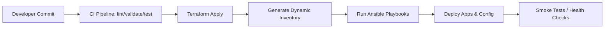
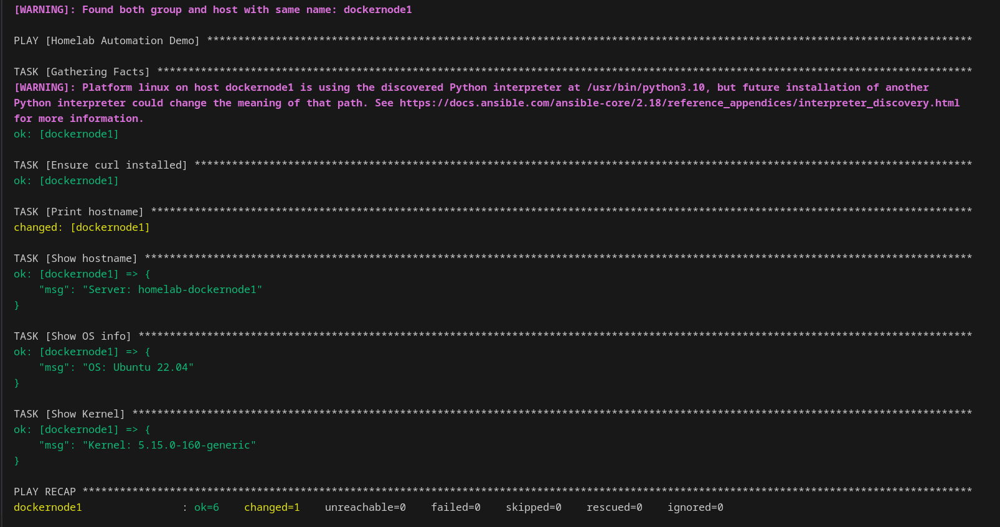
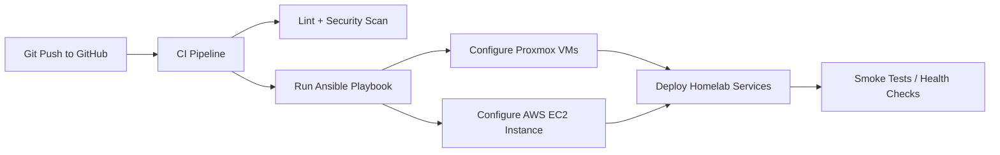

# Ansible Automation

My homelab uses Ansible to automatically configure and deploy workloads across:

- 🏠 **Proxmox VMs** (Docker nodes, NGINX proxy, Wazuh, PBS)
- ☁️ **AWS EC2 instances** (created via Terraform)
- 🗃️ **45Drives NFS storage**
- 🔐 **Security services** (hardening, users, SSH, fail2ban)
- 📦 **Application stack** (Docker containers, monitoring, reverse proxy)

This ensures consistent, repeatable infrastructure both at home and in the cloud.

---

## 🚀 End-to-End Automation Flow



## 📋 Example Inventory

```ini
[proxmox]
dockenode1 ansible_host=192.168.1.201
dockenode2 ansible_host=192.168.1.202
wazuh ansible_host=192.168.1.203
proxy ansible_host=192.168.1.204
pbs ansible_host=192.168.1.205

[aws]
aws-prod ansible_host=54.123.45.67
```

## 📝 Example Playbook

```yaml
- name: Base configuration
  hosts: all
  become: yes

  roles:
    - common      # users, system settings
    - security    # firewall, fail2ban, ssh hardening
    - docker      # docker + compose install
```

## ✅ Ansible Execution Screenshot

Below is a real run of my Ansible playbook against my homelab VMs:



## 🔧 Ansible Workflow Diagram



## 📋 Example Inventory (Production)

```ini
[proxmox]
192.xxx.x.xxx
192.xxx.x.xxx

[aws]
3.89.xx.xx
```

## 📝 Demo Playbook Example

```yaml
- name: Homelab Automation Demo
  hosts: all
  become: true

  tasks:
    - name: Ping test
      ping:

    - name: Ensure NGINX installed (example)
      apt:
        name: nginx
        state: present
      when: ansible_os_family == "Debian"
```

---

## 📊 Monitoring Role

Automates deployment of Prometheus Node Exporter to infrastructure for metrics collection.

### Features

- ✅ Installs Node Exporter as systemd service
- ✅ Automatic firewall configuration
- ✅ Security hardening (unprivileged user, systemd protections)
- ✅ Version management & idempotent updates
- ✅ Health check verification

### Quick Deploy

```bash
# Deploy to all hosts
cd ansible
ansible-playbook playbooks/deploy-monitoring.yml

# Deploy to specific group
ansible-playbook playbooks/deploy-monitoring.yml --limit monitoring

# Verify installation
ansible all -m uri -a "url=http://localhost:9100/metrics status_code=200"
```

### Integration with Prometheus

After deployment, add hosts to `docker/monitoring-stack/prometheus/prometheus.yml`:

```yaml
scrape_configs:
  - job_name: 'node_exporter_homelab'
    static_configs:
      - targets:
          - 'server1.local:9100'
          - 'server2.local:9100'
          - 'server3.local:9100'
        labels:
          environment: 'homelab'
```

See the [monitoring role on GitHub](https://github.com/iso-st3ph/homelab-devops/tree/main/ansible/roles/monitoring) for complete documentation.

---

## 🔐 Security Role

Coming soon: Automated security hardening, SSH configuration, and fail2ban setup.


