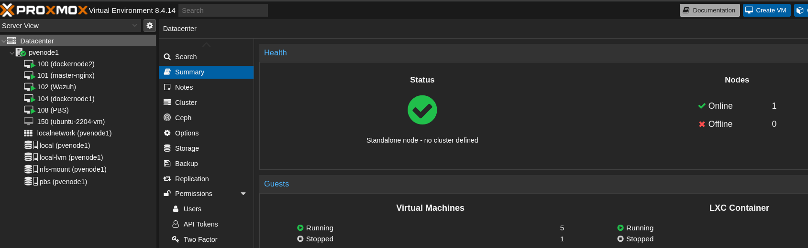

# Architecture

```mermaid
flowchart LR
  Dev[Developer] -->|Git push| CI[GitHub Actions/Jenkins]
  CI --> Lint[pre-commit · TFLint · Checkov · Hadolint · ansible-lint]
  CI --> Plan[Terraform Plan] --> Gate[Manual Approve] --> Apply[Terraform Apply]
  Apply --> AWS[AWS EC2]
  Apply --> Proxmox[Proxmox VM]
  Proxmox --> NFS[45Drives NFS]
  AWS --> Ansible[Ansible Configure]
  Proxmox --> Ansible
  Ansible --> Proxy[Reverse Proxy (Docker)]
  Proxy --> Smoke[Health/Smoke]
```
## Proxmox Virtualization Layer

> This node runs my core homelab workloads: Docker nodes, Nginx reverse proxy, Wazuh, an Ubuntu admin VM, NFS mount (45Drives), and Proxmox Backup Server (PBS).

<div align="center">
  
</div>
