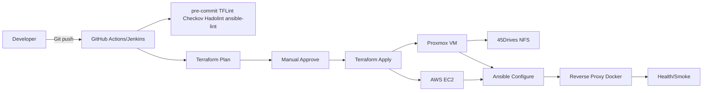

# Architecture

## Proxmox Virtualization Layer

> This node runs my core homelab workloads: Docker nodes, Nginx reverse proxy, Wazuh, an Ubuntu admin VM, NFS mount (45Drives), and Proxmox Backup Server (PBS).

  

