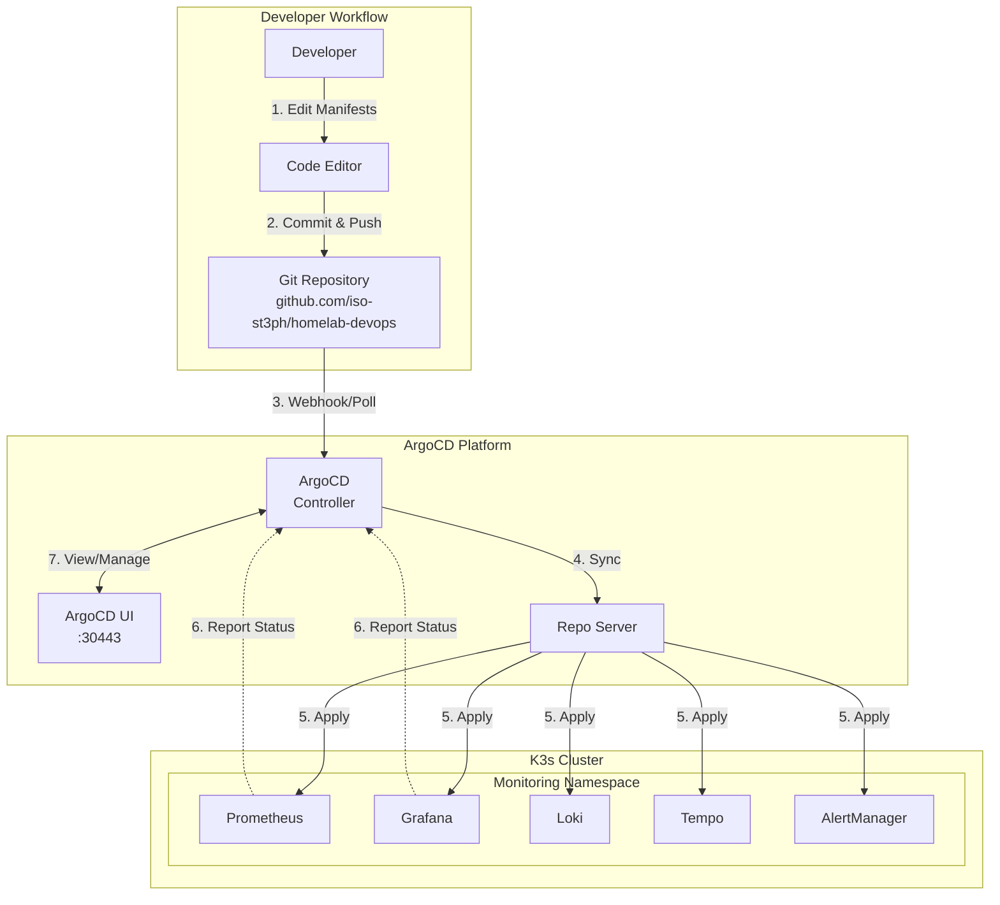

# GitOps with ArgoCD

This guide demonstrates the implementation of GitOps methodology using ArgoCD for declarative, continuous deployment to our K3s Kubernetes cluster.

## 🎯 What is GitOps?

GitOps is a modern approach to continuous deployment where:

- **Git is the single source of truth** for declarative infrastructure and applications
- **Automated processes** sync desired state from Git to production
- **Continuous reconciliation** ensures cluster state matches Git state
- **Complete audit trail** via Git history of all changes
- **Easy rollbacks** through Git revert operations

## 🏗️ Architecture



## 🚀 Quick Start

### Access ArgoCD UI

```bash
# Get admin password
kubectl get secret argocd-initial-admin-secret -n argocd \
  -o jsonpath="{.data.password}" | base64 -d && echo

# Or use Makefile
make argocd-ui

# Access UI
# URL: https://localhost:30443
# Username: admin
```

### Deploy Application

```bash
# Apply AppProject and Application
make argocd-apps

# Check status
make argocd-status
```

## 📦 Current Applications

### Monitoring Stack

**Repository**: `https://github.com/iso-st3ph/homelab-devops.git`  
**Path**: `kubernetes/monitoring/`  
**Namespace**: `monitoring`

**Services Deployed**:

- **Prometheus** - Metrics collection and storage
- **Grafana** - Visualization and dashboards
- **Loki** - Log aggregation
- **Tempo** - Distributed tracing
- **AlertManager** - Alert routing and notification

**Sync Policy**:

```yaml
syncPolicy:
  automated:
    prune: true       # Remove resources deleted from Git
    selfHeal: true    # Auto-correct drift
    allowEmpty: false
  syncOptions:
    - CreateNamespace=true
  retry:
    limit: 5
    backoff:
      duration: 5s
      factor: 2
      maxDuration: 3m
```

## 🔄 GitOps Workflow

### Making Changes

1. **Edit Manifests Locally**

   ```bash
   cd kubernetes/monitoring/
   # Edit deployment, configmap, etc.
   vim 03-prometheus.yaml
   ```

2. **Commit Changes**

   ```bash
   git add kubernetes/monitoring/
   git commit -m "feat(monitoring): increase Prometheus retention to 30 days"
   ```

3. **Push to GitHub**

   ```bash
   git push origin main
   ```

4. **ArgoCD Auto-Sync** (within 3 minutes)
   - ArgoCD detects changes in Git
   - Compares desired state (Git) vs actual state (cluster)
   - Applies differences to cluster
   - Reports health status

### Manual Sync

```bash
# Trigger immediate sync
make argocd-sync

# Or via kubectl
kubectl patch application monitoring-stack -n argocd \
  --type merge -p '{"operation":{"initiatedBy":{"username":"admin"},"sync":{}}}'
```

### Rollback

```bash
# Revert Git commit
git revert HEAD
git push origin main

# ArgoCD auto-syncs rollback within 3 minutes
# Or manually sync for immediate rollback
make argocd-sync
```

## 📊 Monitoring & Status

### Application Health

```bash
# Get sync and health status
kubectl get application monitoring-stack -n argocd

# Detailed status
kubectl describe application monitoring-stack -n argocd
```

**Health Status Meanings**:

- **Healthy**: All resources running as expected
- **Progressing**: Resources being created/updated
- **Degraded**: Some resources failing
- **Missing**: Resources not found in cluster

**Sync Status**:

- **Synced**: Cluster state matches Git state
- **OutOfSync**: Cluster differs from Git
- **Unknown**: Unable to determine sync status

### Resource Status

```bash
# View managed resources
kubectl get application monitoring-stack -n argocd \
  -o jsonpath='{.status.resources[*].name}' | tr ' ' '\n'

# Resource health details
kubectl get application monitoring-stack -n argocd \
  -o jsonpath='{.status.resources[*].health.status}'
```

### Sync History

```bash
# View sync history in UI
# Navigate to: Applications → monitoring-stack → History

# Via CLI
kubectl get application monitoring-stack -n argocd \
  -o jsonpath='{.status.history}'
```

## 🎛️ Advanced Features

### Sync Waves

Control deployment order with annotations:

```yaml
apiVersion: v1
kind: ConfigMap
metadata:
  name: app-config
  annotations:
    argocd.argoproj.io/sync-wave: "0"  # Deploy first
---
apiVersion: apps/v1
kind: Deployment
metadata:
  name: app
  annotations:
    argocd.argoproj.io/sync-wave: "1"  # Deploy after configmaps
```

**Common Wave Strategy**:

- Wave -1: Namespace creation
- Wave 0: ConfigMaps, Secrets
- Wave 1: PVCs, Services
- Wave 2: Deployments, StatefulSets
- Wave 3: Ingress, Routes

### Resource Hooks

Run jobs at specific sync phases:

```yaml
apiVersion: batch/v1
kind: Job
metadata:
  name: database-migration
  annotations:
    argocd.argoproj.io/hook: PreSync
    argocd.argoproj.io/hook-delete-policy: HookSucceeded
spec:
  template:
    spec:
      containers:
        - name: migrate
          image: my-app:latest
          command: ["./migrate.sh"]
```

**Hook Types**:

- `PreSync`: Before sync
- `Sync`: During sync
- `PostSync`: After sync
- `SyncFail`: On sync failure
- `Skip`: Skip resource in sync

### Ignore Differences

Prevent sync on specific fields:

```yaml
ignoreDifferences:
  - group: apps
    kind: Deployment
    jsonPointers:
      - /spec/replicas  # Ignore replica count (for HPA)
  - group: apps
    kind: StatefulSet
    jsonPointers:
      - /spec/volumeClaimTemplates  # Ignore PVC changes
```

## 🔐 Security & RBAC

### AppProjects

Our `homelab` AppProject provides:

**Repository Access**:

```yaml
sourceRepos:
  - https://github.com/iso-st3ph/homelab-devops.git
```

**Destination Control**:

```yaml
destinations:
  - namespace: '*'
    server: https://kubernetes.default.svc
```

**RBAC Roles**:

- **Admin**: Full application management
- **Developer**: Read and sync only

### Authentication

ArgoCD supports multiple auth methods:

- **Local users** (current: admin)
- **SSO** (OIDC, SAML, LDAP)
- **API tokens** for CI/CD integration

### Secrets Management

**Current Approach**: Secrets in Kubernetes

```bash
# Example: Create secret for Grafana
kubectl create secret generic grafana-admin \
  --from-literal=password='secure-password' \
  -n monitoring
```

**Best Practices**:

- Use Sealed Secrets or External Secrets Operator
- Reference secrets in manifests, don't commit plaintext
- Rotate credentials regularly

## 📈 Multi-Environment Strategy

### Using Git Branches

```text
main → production (auto-sync enabled)
staging → staging namespace (auto-sync enabled)
develop → development namespace (manual sync)
```

### Using Kustomize Overlays

```text
kubernetes/
├── base/
│   ├── deployment.yaml
│   └── kustomization.yaml
└── overlays/
    ├── dev/
    │   └── kustomization.yaml
    ├── staging/
    │   └── kustomization.yaml
    └── prod/
        └── kustomization.yaml
```

### ApplicationSet Pattern

```yaml
apiVersion: argoproj.io/v1alpha1
kind: ApplicationSet
metadata:
  name: monitoring-multi-env
spec:
  generators:
    - list:
        elements:
          - env: dev
            replicas: 1
          - env: prod
            replicas: 3
  template:
    spec:
      source:
        path: kubernetes/monitoring
        helm:
          parameters:
            - name: replicas
              value: '{{replicas}}'
```

## 🛠️ Troubleshooting

### Application Not Syncing

**Check sync settings**:

```bash
kubectl get application monitoring-stack -n argocd -o yaml | grep -A 10 syncPolicy
```

**Manual refresh**:

```bash
kubectl patch application monitoring-stack -n argocd \
  --type merge -p '{"metadata":{"annotations":{"argocd.argoproj.io/refresh":"normal"}}}'
```

### Resources Stuck in Progressing

**Check pod status**:

```bash
kubectl get pods -n monitoring
kubectl describe pod <pod-name> -n monitoring
```

**View ArgoCD logs**:

```bash
kubectl logs -n argocd -l app.kubernetes.io/name=argocd-application-controller
```

### Sync Fails

**View sync operation**:

```bash
kubectl get application monitoring-stack -n argocd -o yaml | grep -A 20 operation
```

**Check for validation errors**:

```bash
kubectl describe application monitoring-stack -n argocd | grep -A 20 Conditions
```

## 🎯 Best Practices

### ✅ Do

- **Commit all manifests to Git** - Git is source of truth
- **Use meaningful commit messages** - They become deployment history
- **Enable auto-sync for production** - Reduce manual intervention
- **Use sync waves** - Control deployment order
- **Implement health checks** - Ensure reliable deployments
- **Monitor sync status** - Set up alerts for failed syncs
- **Use AppProjects** - Isolate teams and environments

### ❌ Don't

- **Don't kubectl apply manually** - Bypasses GitOps
- **Don't edit resources in cluster** - Changes will be overwritten
- **Don't disable self-heal** - Defeats purpose of GitOps
- **Don't commit secrets** - Use secret management tools
- **Don't ignore sync errors** - Fix root cause, don't retry blindly

## 📚 Integration Examples

### CI/CD Pipeline Integration

```yaml
# GitHub Actions
- name: Update Deployment Image
  run: |
    yq eval '.spec.template.spec.containers[0].image = "${{ env.IMAGE }}"' \
      -i kubernetes/monitoring/03-prometheus.yaml
    git commit -am "chore: update Prometheus image to ${{ env.IMAGE }}"
    git push
    # ArgoCD auto-syncs new image within 3 minutes
```

### Notification Webhooks

Configure Slack/email notifications:

```yaml
apiVersion: v1
kind: ConfigMap
metadata:
  name: argocd-notifications-cm
data:
  service.slack: |
    token: $slack-token
  trigger.on-sync-succeeded: |
    - send: [app-deployed]
```

## 🎓 Skills Demonstrated

This GitOps implementation showcases:

- ✅ **GitOps Methodology** - Declarative, Git-based deployments
- ✅ **Continuous Deployment** - Automated sync from Git to cluster
- ✅ **Self-Healing Infrastructure** - Automatic drift correction
- ✅ **Declarative Management** - Desired state in version control
- ✅ **RBAC & Security** - Role-based access with AppProjects
- ✅ **Audit & Compliance** - Complete change history in Git
- ✅ **Production Patterns** - Sync waves, hooks, multi-environment
- ✅ **Disaster Recovery** - Git-based rollback capability

## 📖 References

- [ArgoCD Documentation](https://argo-cd.readthedocs.io/)
- [GitOps Principles](https://opengitops.dev/)
- [ArgoCD Best Practices](https://argo-cd.readthedocs.io/en/stable/user-guide/best_practices/)
- [CNCF GitOps Working Group](https://github.com/cncf/tag-app-delivery/tree/main/gitops-wg)

---

Built by [Stephon Skipper](https://www.linkedin.com/in/stephon-skipper/) | [GitHub](https://github.com/iso-st3ph/homelab-devops)
