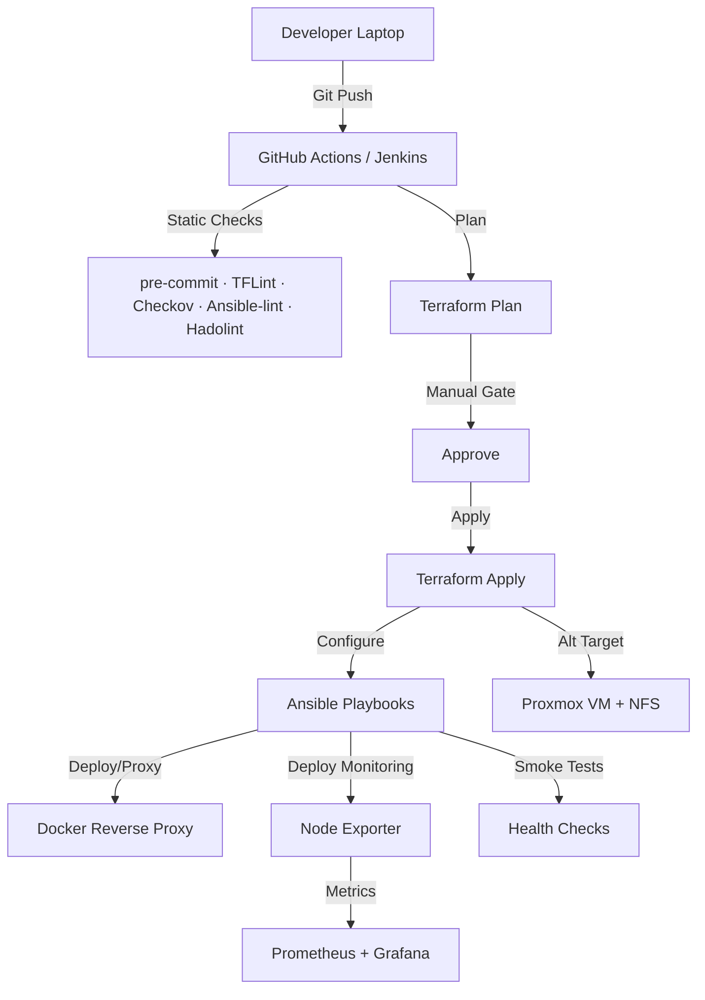

# Homelab DevOps Overview

> :rocket: **Golden Path** — _lint → plan → approve → apply → configure → monitor → smoke_ across AWS & homelab (Proxmox/NFS).  
> Built with **Terraform · Ansible · Docker · Prometheus · Grafana · GitHub Actions · Jenkins · MkDocs**.

[](https://github.com/iso-st3ph/homelab-devops/actions/workflows/ci.yml)
[](https://github.com/iso-st3ph/homelab-devops/actions/workflows/infra-ci.yml)
[](https://github.com/iso-st3ph/homelab-devops/actions/workflows/docs.yml)

## Pipeline at a glance



## 📁 Projects

- 🏗️ [Terraform Infrastructure](terraform.md) - AWS EC2 provisioning with security best practices
- 🤖 [Ansible Automation](ansible.md) - Configuration management and monitoring deployment
- � [Monitoring Stack](monitoring.md) - Prometheus + Grafana observability platform
- �🐳 [Docker / Reverse Proxy](docker.md) - Containerized services with Nginx
- 🛰️ End-to-end DevOps CI/CD Lab

---

## 🎯 About This Lab

This homelab is built to simulate real-world DevOps:

✅ Git-based workflows  
✅ CI pipelines & automated linting  
✅ Terraform infrastructure provisioning  
✅ Ansible configuration management  
✅ Prometheus + Grafana monitoring & observability  
✅ Docker applications behind a reverse proxy  
✅ Security hardening (SELinux, systemd, firewall automation)

> Goal: Operate like a production infrastructure in a home lab environment.

---

## 🚀 Quick Start

### Monitoring Stack
```bash
# Start Prometheus + Grafana
make mon-up

# Access Grafana at http://localhost:3001
```

### Deploy Node Exporter to Hosts
```bash
cd ansible
ansible-playbook playbooks/deploy-monitoring.yml
```

### Provision Infrastructure
```bash
cd terraform/aws-ec2
terraform init && terraform plan
```

---

## 🛠️ Tech Stack

| Component | Technology |
|-----------|------------|
| **Infrastructure** | Terraform, AWS EC2, Proxmox |
| **Configuration** | Ansible, systemd |
| **Monitoring** | Prometheus, Grafana, Node Exporter, cAdvisor |
| **Containers** | Docker, Docker Compose |
| **CI/CD** | GitHub Actions, Jenkins, pre-commit |
| **Documentation** | MkDocs Material |

---

Built by [Stephon Skipper](https://www.linkedin.com/in/stephon-skipper/) | [Portfolio Site](https://ayoskip.info)
