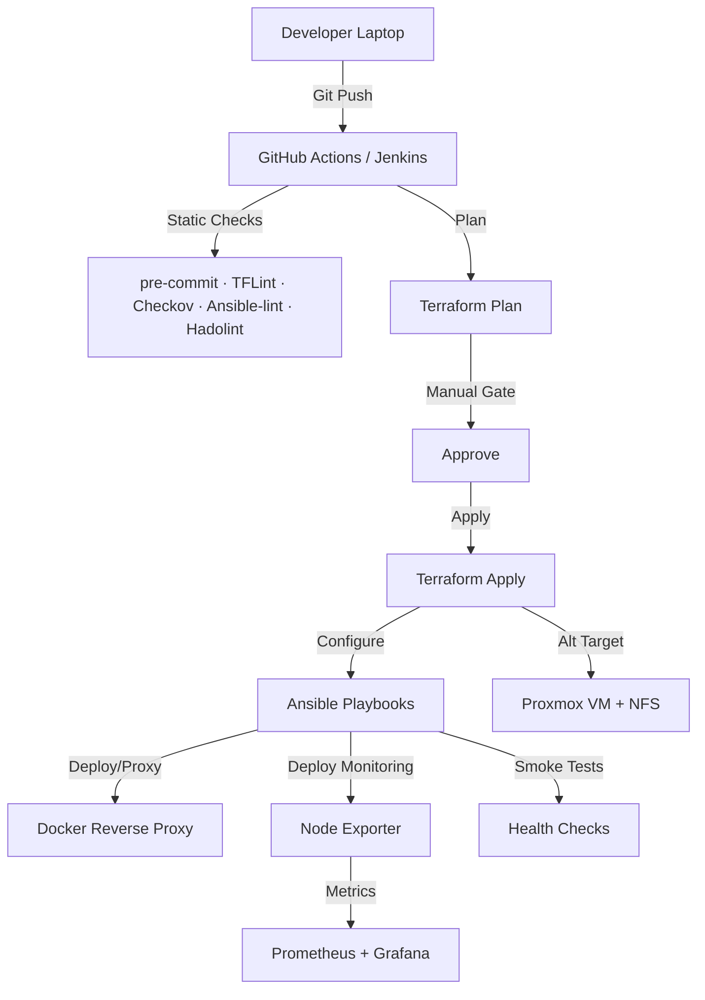

# Homelab DevOps Overview

> :rocket: **Golden Path** — _lint → plan → approve → apply → configure → monitor → smoke_ across AWS & homelab (Proxmox/NFS).  
> Built with **Terraform · Ansible · Docker · Prometheus · Grafana · GitHub Actions · Jenkins · MkDocs**.

[](https://github.com/iso-st3ph/homelab-devops/actions/workflows/ci.yml)
[](https://github.com/iso-st3ph/homelab-devops/actions/workflows/infra-ci.yml)
[](https://github.com/iso-st3ph/homelab-devops/actions/workflows/docs.yml)

## Pipeline at a glance



## 📁 Projects

- 🏗️ [Terraform Infrastructure](terraform.md) - Multi-environment AWS provisioning with testing
- 🤖 [Ansible Automation](ansible.md) - Configuration management with Vault secrets
- ☸️ [Kubernetes (K3s)](kubernetes.md) - Production monitoring stack on K8s cluster
- 🔄 [GitOps (ArgoCD)](gitops.md) - Declarative deployment with auto-sync and self-heal
- 🚀 [Jenkins CI/CD](jenkins.md) - Kubernetes-based with dynamic agent provisioning
- 📦 [Packer Images](packer.md) - Automated AMI builds with security hardening
- 📊 [Monitoring Stack](monitoring.md) - Prometheus + Grafana + Loki + Tempo + AlertManager
- 📈 [Grafana Dashboards](grafana-dashboards.md) - 4 production dashboards auto-provisioned
- 🔒 [Security Scanning](security.md) - Trivy container vulnerability scanning
- 🐳 [Docker / Reverse Proxy](docker.md) - Containerized services with Nginx

---

## 🎯 About This Lab

This homelab demonstrates production-ready DevOps practices:

✅ Git-based workflows with CI/CD  
✅ Infrastructure as Code (Terraform with multi-environment)  
✅ Configuration management (Ansible with encrypted secrets)  
✅ Kubernetes orchestration (K3s with production workloads)  
✅ GitOps deployment (ArgoCD managing 2 applications)  
✅ CI/CD pipelines (Jenkins on K8s with dynamic agents)  
✅ Immutable infrastructure (Packer AMI builds with hardening)  
✅ Full observability stack (Metrics + Logs + Traces)  
✅ Production alerting with Slack integration  
✅ Container security scanning (Trivy in CI/CD)  
✅ Auto-provisioned Grafana dashboards (4 production-ready)  
✅ Centralized logging (Loki + Promtail, 30-day retention)  
✅ Distributed tracing (Tempo with trace correlation)  
✅ Docker containerization with reverse proxy  
✅ Security hardening (SSH, firewall, IDS, antivirus)  
✅ Automated testing & validation  
✅ Disaster recovery (backup/restore automation)

> **Goal**: Operate like production infrastructure in a homelab, demonstrating enterprise-grade DevOps skills.

---

## 🚀 Quick Start

### Monitoring Stack
```bash
# Start Prometheus + Grafana
make mon-up

# Access Grafana at http://localhost:3001
```

### Deploy Node Exporter to Hosts
```bash
cd ansible
ansible-playbook playbooks/deploy-monitoring.yml
```

### Provision Infrastructure
```bash
cd terraform/aws-ec2
terraform init && terraform plan
```

---

## 🛠️ Tech Stack

| Component | Technology |
|-----------|------------|
| **Infrastructure** | Terraform, AWS EC2, Proxmox |
| **Configuration** | Ansible, systemd |
| **Orchestration** | Kubernetes (K3s), Docker Compose |
| **GitOps** | ArgoCD (declarative deployment, auto-sync) |
| **CI/CD** | Jenkins (K8s dynamic agents), GitHub Actions |
| **Image Automation** | Packer (hardened AMI builds) |
| **Monitoring** | Prometheus, Grafana, AlertManager, Node Exporter, cAdvisor |
| **Logging** | Loki, Promtail |
| **Tracing** | Tempo (OTLP, trace correlation) |
| **Security** | Trivy, Ansible Vault, SELinux |
| **Containers** | Docker, Docker Compose |
| **CI/CD** | GitHub Actions, Jenkins, pre-commit |
| **Documentation** | MkDocs Material |

---

Built by [Stephon Skipper](https://www.linkedin.com/in/stephon-skipper/) | [Portfolio Site](https://ayoskip.info)
