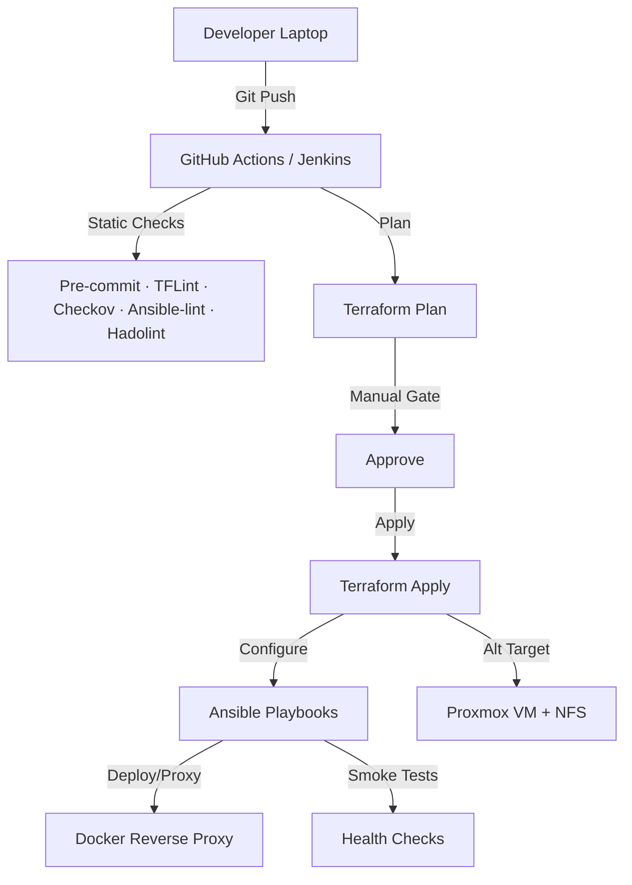

# Homelab DevOps Overview

> :rocket: **Goal:** Demonstrate a production-style DevOps pipeline: _lint → plan → approve → apply → configure → smoke test_ across cloud and homelab targets.

## Pipeline at a glance

