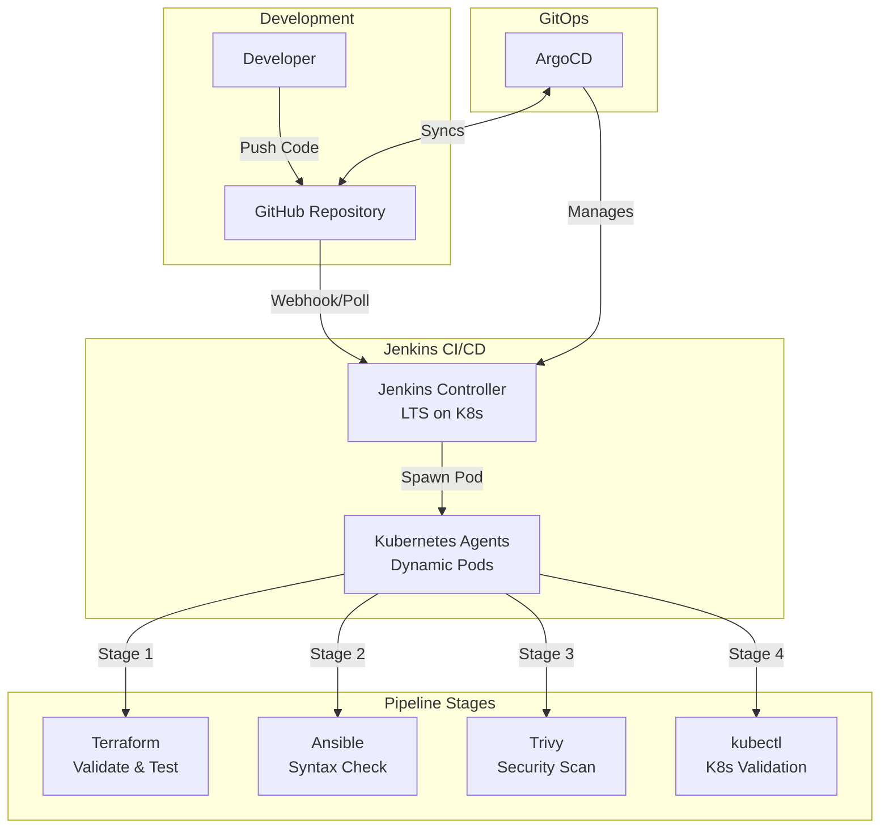

# Jenkins CI/CD on Kubernetes

Production-ready Jenkins deployment on K3s with dynamic Kubernetes agent provisioning and comprehensive CI/CD pipelines.

## 🎯 Overview

This Jenkins implementation demonstrates cloud-native CI/CD with:

- **Jenkins Controller on Kubernetes** - LTS version with persistent storage
- **Dynamic Agent Provisioning** - Kubernetes plugin spawns pods on-demand
- **Configuration as Code** - JCasC for reproducible setups
- **Multi-stage Pipelines** - Terraform, Ansible, security scanning, K8s validation
- **GitOps Management** - ArgoCD manages Jenkins deployment

## 🏗️ Architecture



## 📦 Components

### Jenkins Controller

**Deployment Configuration**:

- **Image**: `jenkins/jenkins:lts`
- **Replicas**: 1 (stateful application)
- **Resources**: 500m CPU / 1Gi RAM (request), 2 CPU / 3Gi RAM (limit)
- **Storage**: 20Gi PersistentVolumeClaim (local-path storage class)
- **Ports**: 8080 (UI), 50000 (JNLP for agents)
- **Access**: NodePort 30808

### Kubernetes Plugin

**Dynamic Agent Provisioning**:

- Spawns pods in `jenkins` namespace on-demand
- Auto-cleanup after job completion
- Max 10 concurrent agents
- Resource limits: 500m CPU / 512Mi RAM per agent
- JNLP tunnel for controller-agent communication

### Pipeline Containers

Each agent pod includes specialized containers:

- **terraform** - `hashicorp/terraform:latest` for IaC validation/testing
- **ansible** - `cytopia/ansible:latest` for playbook syntax checks
- **trivy** - `aquasec/trivy:latest` for security scanning
- **kubectl** - `bitnami/kubectl:latest` for K8s manifest validation

## 🚀 Deployment

### Quick Start

```bash
# Deploy Jenkins
make jenkins-deploy

# Check status
make jenkins-status

# View logs
make jenkins-logs

# Get UI access details
make jenkins-ui
```

### GitOps Deployment

```bash
# Deploy via ArgoCD
make jenkins-app

# Check ArgoCD sync status
kubectl get application jenkins -n argocd
```

### Manual Deployment

```bash
cd kubernetes/jenkins

# Apply all manifests
kubectl apply -f .

# Wait for pod ready
kubectl wait --for=condition=ready pod -l app=jenkins -n jenkins --timeout=300s
```

## 🔧 Configuration

### Jenkins Configuration as Code (JCasC)

Jenkins is configured via JCasC (`kubernetes/jenkins/03-configmap.yaml`):

```yaml
jenkins:
  systemMessage: "Jenkins - DevOps Portfolio CI/CD Server"
  numExecutors: 0  # All jobs run on Kubernetes agents
  clouds:
    - kubernetes:
        name: "kubernetes"
        serverUrl: "https://kubernetes.default"
        namespace: "jenkins"
        containerCapStr: "10"
        templates:
          - name: "jenkins-agent"
            containers:
              - name: "jnlp"
                image: "jenkins/inbound-agent:latest"
                resourceRequestCpu: "500m"
                resourceRequestMemory: "512Mi"
```

**Benefits**:

- ✅ No manual setup wizard
- ✅ Reproducible configuration
- ✅ Version controlled in Git
- ✅ Easy to update and redeploy

### RBAC Permissions

Jenkins ServiceAccount has ClusterRole permissions for:

- **Pods**: create, delete, get, list, patch, update, watch
- **Pods/exec**: Full access for running commands in agents
- **Pods/log**: Read logs from agent pods
- **Secrets**: Manage credentials
- **ConfigMaps**: Manage configuration
- **PVCs**: Manage persistent storage

## 📋 CI/CD Pipeline

### Jenkinsfile Overview

The root `Jenkinsfile` demonstrates a complete CI/CD pipeline:

**Stages**:

1. **Checkout** - Clone repository from Git
2. **Terraform Validation** - Format check, init, validate
3. **Terraform Test** - Run module tests
4. **Ansible Syntax Check** - Validate all playbooks
5. **Security Scan - IaC** - Trivy config scanning (Terraform + K8s)
6. **Security Scan - Images** - Trivy container image scanning
7. **Kubernetes Validation** - kubectl dry-run validation
8. **Summary** - Report pipeline results

### Example Pipeline Definition

```groovy
pipeline {
  agent {
    kubernetes {
      yaml '''
        # Pod spec with terraform, ansible, trivy, kubectl containers
      '''
    }
  }

  stages {
    stage('Terraform Validation') {
      steps {
        container('terraform') {
          sh '''
            terraform init -backend=false
            terraform validate
            terraform fmt -check
          '''
        }
      }
    }

    stage('Security Scan') {
      steps {
        container('trivy') {
          sh 'trivy config terraform/'
        }
      }
    }
  }

  post {
    always {
      cleanWs()
    }
  }
}
```

### Running the Pipeline

1. **Create Pipeline Job** in Jenkins UI
2. **Configure** → Pipeline from SCM → Git
3. **Repository URL**: `https://github.com/iso-st3ph/homelab-devops.git`
4. **Branch**: `main`
5. **Script Path**: `Jenkinsfile`
6. **Save** and **Build Now**

## 📊 Monitoring & Operations

### Check Deployment Status

```bash
# Pods
kubectl get pods -n jenkins

# Services
kubectl get svc -n jenkins

# PersistentVolumeClaims
kubectl get pvc -n jenkins

# Full status
make jenkins-status
```

### View Logs

```bash
# Controller logs
kubectl logs -n jenkins -l app=jenkins -f

# Or via Makefile
make jenkins-logs

# Agent logs (during job)
kubectl logs -n jenkins <agent-pod-name> -c terraform
```

### Access Jenkins UI

```
URL: http://localhost:30808
```

Since JCasC disables the setup wizard, Jenkins starts ready to use. Create jobs directly or configure authentication as needed.

### Restart Jenkins

```bash
# Rollout restart (zero downtime)
kubectl rollout restart deployment/jenkins -n jenkins

# Check rollout status
kubectl rollout status deployment/jenkins -n jenkins
```

## 🔐 Security Features

### Container Security

- **Non-root user** - Jenkins runs as UID 1000
- **Read-only ConfigMap** - Configuration mounted read-only
- **Resource limits** - CPU/memory limits prevent resource exhaustion
- **Security scanning** - Trivy scans in pipeline

### RBAC

- **ServiceAccount** - Dedicated `jenkins` service account
- **ClusterRole** - Scoped permissions for pod/secret management
- **Namespace isolation** - Jenkins runs in dedicated namespace

### Secrets Management

```bash
# Create secret for credentials
kubectl create secret generic github-token \
  --from-literal=token='ghp_xxxxxxxxxxxx' \
  -n jenkins

# Reference in pipeline
withCredentials([string(credentialsId: 'github-token', variable: 'TOKEN')]) {
  sh 'echo $TOKEN'
}
```

## 🎯 Best Practices

### Pipeline Design

✅ **Use Kubernetes agents** - Don't run jobs on controller (numExecutors: 0)  
✅ **Container per tool** - Separate containers for Terraform, Ansible, etc.  
✅ **Resource limits** - Set CPU/memory limits on agents  
✅ **Clean workspace** - Use `cleanWs()` in post-always  
✅ **Timeout stages** - Prevent hung jobs  
✅ **Parallel stages** - Speed up pipeline with parallel execution

### Configuration

✅ **Use JCasC** - Configuration as Code in version control  
✅ **Persistent storage** - PVC for jenkins_home  
✅ **Health checks** - Liveness and readiness probes  
✅ **GitOps** - Manage Jenkins deployment via ArgoCD  
✅ **Immutable tags** - Pin container image versions

### Security

✅ **Scan dependencies** - Trivy/Checkov in pipeline  
✅ **RBAC** - Minimal permissions for ServiceAccount  
✅ **Secrets** - Use Kubernetes secrets, not hardcoded values  
✅ **Network policies** - Restrict pod-to-pod communication (optional)  
✅ **Audit logs** - Enable Jenkins audit trail plugin

## 🛠️ Troubleshooting

### Jenkins Pod Not Starting

**Check pod status**:

```bash
kubectl describe pod -n jenkins <pod-name>
kubectl logs -n jenkins <pod-name>
```

**Common issues**:

- PVC not bound → Check storage class exists
- Resource limits too low → Increase CPU/RAM
- Image pull errors → Check image availability

### Agents Not Spawning

**Check**:

1. ServiceAccount has correct RBAC → `kubectl describe clusterrole jenkins`
2. Kubernetes plugin configured → JCasC in ConfigMap
3. Jenkins URL accessible → `http://jenkins:8080` from pods
4. JNLP port open → Service exposes port 50000

**Debug**:

```bash
# Check plugin configuration
kubectl exec -n jenkins <jenkins-pod> -- cat /var/jenkins_config/jenkins.yaml

# Test connectivity
kubectl run test-pod --rm -it --image=busybox -- wget -O- http://jenkins:8080
```

### UI Not Accessible

**Port forward as alternative**:

```bash
kubectl port-forward -n jenkins svc/jenkins 8080:8080
# Access at http://localhost:8080
```

**Check NodePort**:

```bash
kubectl get svc jenkins -n jenkins
# Verify nodePort is 30808
```

### Pipeline Fails with Permission Denied

**Increase RBAC permissions**:

```bash
# Edit ClusterRole
kubectl edit clusterrole jenkins

# Add additional resource permissions as needed
```

## 📈 Scaling & Performance

### Horizontal Scaling

❌ **Don't scale Jenkins controller replicas** (stateful)  
✅ **Scale agents** by increasing `containerCapStr` in JCasC

### Vertical Scaling

Increase controller resources in deployment:

```yaml
resources:
  requests:
    cpu: 1000m
    memory: 2Gi
  limits:
    cpu: 4000m
    memory: 6Gi
```

### Performance Tuning

- **Increase agent capacity** - Raise `containerCapStr` to 20+
- **Use node selectors** - Pin agents to specific nodes
- **Enable caching** - Cache dependencies between builds
- **Optimize pipelines** - Parallel stages, skip unnecessary steps

## 🎓 Skills Demonstrated

- ✅ **Jenkins on Kubernetes** - Cloud-native CI/CD platform
- ✅ **Dynamic Agent Provisioning** - Kubernetes plugin with pod templates
- ✅ **Configuration as Code** - JCasC for reproducible setup
- ✅ **Declarative Pipelines** - Groovy-based Jenkinsfile
- ✅ **Multi-stage CI/CD** - Validate → Test → Scan → Deploy
- ✅ **Container-based Jobs** - Specialized containers per stage
- ✅ **Security Integration** - Trivy scanning in pipeline
- ✅ **GitOps Workflow** - ArgoCD managing Jenkins deployment
- ✅ **RBAC** - Kubernetes service account and role bindings
- ✅ **Persistent Storage** - PVC for stateful data

## 📚 References

- [Jenkins on Kubernetes](https://www.jenkins.io/doc/book/installing/kubernetes/)
- [Kubernetes Plugin Documentation](https://plugins.jenkins.io/kubernetes/)
- [Jenkins Configuration as Code](https://www.jenkins.io/projects/jcasc/)
- [Pipeline Syntax Reference](https://www.jenkins.io/doc/book/pipeline/syntax/)
- [Declarative Pipeline](https://www.jenkins.io/doc/book/pipeline/)

---

Built by [Stephon Skipper](https://www.linkedin.com/in/stephon-skipper/) | [GitHub](https://github.com/iso-st3ph/homelab-devops)
