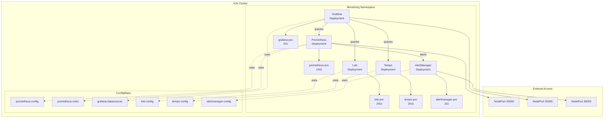

# Kubernetes (K3s) Deployment

This guide covers the Kubernetes deployment of our complete observability stack using K3s, a lightweight Kubernetes distribution perfect for homelabs and edge computing.

## 🎯 Overview

We've deployed a production-grade monitoring stack on Kubernetes, demonstrating cloud-native orchestration skills essential for modern DevOps roles.

**Cluster Details:**

- **Distribution:** K3s v1.33.5+k3s1
- **Nodes:** Single-node cluster (can scale to multi-node)
- **Services:** 5 core observability services
- **Storage:** 50Gi total with PersistentVolumeClaims
- **Access:** NodePort services for external access

## 📊 Deployed Services

| Service | Purpose | Type | Access |
|---------|---------|------|--------|
| **Prometheus** | Metrics collection & storage | NodePort | `http://localhost:30090` |
| **Grafana** | Visualization & dashboards | NodePort | `http://localhost:30300` |
| **Loki** | Log aggregation | ClusterIP | Internal (3100) |
| **Tempo** | Distributed tracing | ClusterIP | Internal (3200, 4317, 4318) |
| **AlertManager** | Alert routing | NodePort | `http://localhost:30093` |

## 🏗️ Architecture



## 🚀 Quick Start

### Deploy the Stack

```bash
# From repository root
make k8s-deploy
```

This will:

1. Connect to K3s cluster
2. Create `monitoring` namespace
3. Apply all manifests in order
4. Wait for pods to be ready
5. Display access URLs

### Check Status

```bash
# View all resources
make k8s-status

# Or manually
kubectl get all -n monitoring
kubectl get pvc -n monitoring
```

### Access Services

- **Prometheus:** <http://localhost:30090>
- **Grafana:** <http://localhost:30300> (admin/admin)
- **AlertManager:** <http://localhost:30093>

## 🔧 Configuration Highlights

### Prometheus Configuration

**Service Discovery:**

- Kubernetes API servers (auto-discovery)
- Kubernetes nodes (kubelet metrics)
- Kubernetes pods (annotation-based)
- Static configs for monitoring services

**RBAC Permissions:**

- ClusterRole with read access to nodes, services, endpoints, pods
- ServiceAccount: `prometheus`
- ClusterRoleBinding for cross-namespace discovery

**External Labels:**

```yaml
external_labels:
  cluster: 'k3s-homelab'
  environment: 'production'
```

**Storage:**

- 10Gi PersistentVolumeClaim (local-path storage class)
- 15-day retention (`--storage.tsdb.retention.time=15d`)

### Grafana Configuration

**Auto-Provisioned Datasources:**

1. **Prometheus** - Default datasource for metrics
2. **Loki** - Log aggregation with trace correlation
3. **Tempo** - Distributed tracing with full correlation

**Correlation Features:**

- Trace → Logs (via Loki, with tag mapping)
- Trace → Metrics (via Prometheus)
- Logs → Traces (via Tempo)
- Service Maps and Node Graphs enabled

**Plugins:**

- `grafana-piechart-panel` (auto-installed)

### Loki Configuration

**Retention:** 30 days (720h)

**Schema:** TSDB v13 (modern, efficient storage)

**Compaction:**

- Interval: 10 minutes
- Delete request store: filesystem
- Retention cleanup enabled

**Storage:** 20Gi PVC with local filesystem backend

### Tempo Configuration

**Receivers:**

- OTLP gRPC: Port 4317
- OTLP HTTP: Port 4318

**Metrics Generator:**

- Service graphs with histogram buckets
- Span metrics for latency analysis
- Remote write to Prometheus

**Storage:** 20Gi PVC with 30-day retention

### AlertManager Configuration

**Routing:**

- Critical alerts: 5m repeat interval
- Warning alerts: 1h repeat interval
- Grouped by: alertname, cluster, service

**Inhibition Rules:**

- Critical alerts suppress warnings for same instance

## 📋 Kubernetes Manifests

Our deployment uses declarative manifests organized by component:

```text
kubernetes/monitoring/
├── 00-namespace.yaml              # Monitoring namespace
├── 01-prometheus-configmap.yaml   # Prometheus config + K8s SD
├── 02-prometheus-rules.yaml       # Alert rules (K8s + system)
├── 03-prometheus.yaml             # Deployment + PVC + Service + RBAC
├── 04-grafana.yaml                # Deployment + PVC + Service + ConfigMap
├── 05-node-exporter.yaml          # DaemonSet (removed due to port conflict)
├── 06-loki.yaml                   # Deployment + PVC + Service + ConfigMap
├── 07-tempo.yaml                  # Deployment + PVC + Service + ConfigMap
├── 08-alertmanager.yaml           # Deployment + PVC + Service + ConfigMap
├── deploy.sh                      # Automated deployment script
└── README.md                      # Detailed documentation
```

## 🎯 Kubernetes-Specific Features

### Pod Auto-Discovery

Prometheus automatically discovers pods with these annotations:

```yaml
annotations:
  prometheus.io/scrape: "true"
  prometheus.io/port: "8080"
  prometheus.io/path: "/metrics"
```

### Alert Rules for Kubernetes

Pre-configured alerts in `02-prometheus-rules.yaml`:

- **PodCrashLooping** - Pod restarting frequently
- **PodNotReady** - Pod not ready for 10+ minutes
- **NodeExporterDown** - Node metrics unavailable
- **HighCPUUsage** - CPU > 80% for 5 minutes
- **HighMemoryUsage** - Memory > 90% for 5 minutes
- **DiskSpaceLow** - Disk < 15% available

### Resource Limits

All deployments have proper resource requests/limits:

```yaml
resources:
  requests:
    cpu: 250m
    memory: 512Mi
  limits:
    cpu: 1000m
    memory: 2Gi
```

### Health Checks

Liveness and readiness probes configured for all services:

```yaml
livenessProbe:
  httpGet:
    path: /-/healthy
    port: 9090
  initialDelaySeconds: 30
  periodSeconds: 10
```

## 🔍 Querying Kubernetes Metrics

### Example PromQL Queries

**Pod Status:**

```promql
kube_pod_status_phase{namespace="monitoring"}
```

**Pod Restart Count:**

```promql
kube_pod_container_status_restarts_total{namespace="monitoring"}
```

**Node CPU Usage:**

```promql
100 - (avg by (instance) (irate(node_cpu_seconds_total{mode="idle"}[5m])) * 100)
```

### Grafana Dashboards

Import these Kubernetes-focused dashboards:

- **Kubernetes Cluster Monitoring (8588)** - Overview
- **Kubernetes Pod Metrics (6417)** - Pod details
- **Kubernetes Deployment Metrics (8588)** - Deployment health

## 🛠️ Operations

### Scaling Deployments

```bash
# Scale Prometheus to 2 replicas (for HA)
kubectl scale deployment prometheus --replicas=2 -n monitoring

# Check rollout status
kubectl rollout status deployment/prometheus -n monitoring
```

### Updating Configuration

After modifying ConfigMaps:

```bash
# Apply changes
kubectl apply -f kubernetes/monitoring/01-prometheus-configmap.yaml

# Restart deployment to pick up changes
kubectl rollout restart deployment/prometheus -n monitoring
```

### Viewing Logs

```bash
# Prometheus logs
kubectl logs -f deployment/prometheus -n monitoring

# Grafana logs
kubectl logs -f deployment/grafana -n monitoring

# All pod logs in namespace
kubectl logs -f --all-containers -l component=monitoring -n monitoring
```

### Troubleshooting Pods

```bash
# Describe pod for events
kubectl describe pod <pod-name> -n monitoring

# Check pod status
kubectl get pods -n monitoring -o wide

# View recent events
kubectl get events -n monitoring --sort-by='.lastTimestamp'
```

## 📈 Performance & Scaling

### Current Resource Usage

Measured on single-node K3s cluster:

| Service | CPU (avg) | Memory (avg) | Storage |
|---------|-----------|--------------|---------|
| Prometheus | 250m | 800Mi | 10Gi PVC |
| Grafana | 100m | 350Mi | 5Gi PVC |
| Loki | 200m | 600Mi | 20Gi PVC |
| Tempo | 200m | 650Mi | 20Gi PVC |
| AlertManager | 50m | 150Mi | 2Gi PVC |

### Storage Growth

With 15s scrape interval and current targets:

- **Prometheus:** ~500MB/day → 7.5GB/15 days
- **Loki:** ~200MB/day → 6GB/30 days
- **Tempo:** ~300MB/day → 9GB/30 days

Adjust PVC sizes based on your retention and volume needs.

## 🔐 Security

### RBAC Configuration

Prometheus ServiceAccount has minimal required permissions:

```yaml
rules:
  - apiGroups: [""]
    resources: [nodes, services, endpoints, pods]
    verbs: [get, list, watch]
```

### Network Policies

Services use ClusterIP (internal) by default. Only exposed via NodePort:

- Prometheus: 30090
- Grafana: 30300
- AlertManager: 30093

### Secret Management

Grafana admin password can be set via Kubernetes Secret:

```bash
kubectl create secret generic grafana-admin \
  --from-literal=password='your-secure-password' \
  -n monitoring
```

## 🧹 Cleanup

### Remove All Resources

```bash
# Using Makefile
make k8s-clean

# Or manually
kubectl delete namespace monitoring
```

This removes:

- All deployments, services, and pods
- ConfigMaps
- PersistentVolumeClaims (data is deleted!)
- RBAC resources (ClusterRole, ClusterRoleBinding, ServiceAccount)

### Remove Only Workloads (Keep PVCs)

```bash
kubectl delete deployment --all -n monitoring
kubectl delete service --all -n monitoring
```

PVCs remain, allowing you to redeploy without losing data.

## 📚 Next Steps

### GitOps with ArgoCD

Deploy ArgoCD to manage these manifests declaratively:

```bash
# Install ArgoCD
kubectl create namespace argocd
kubectl apply -n argocd -f \
  https://raw.githubusercontent.com/argoproj/argo-cd/stable/manifests/install.yaml
```

### Helm Charts

Convert manifests to Helm chart for easier management:

```bash
helm create homelab-monitoring
# Move manifests into templates/
```

### Service Mesh

Add Linkerd for mTLS and advanced traffic management:

```bash
# Install Linkerd
linkerd install | kubectl apply -f -
linkerd check
```

### Horizontal Pod Autoscaling

Enable HPA based on CPU/memory:

```yaml
apiVersion: autoscaling/v2
kind: HorizontalPodAutoscaler
metadata:
  name: prometheus-hpa
spec:
  scaleTargetRef:
    apiVersion: apps/v1
    kind: Deployment
    name: prometheus
  minReplicas: 1
  maxReplicas: 3
  metrics:
  - type: Resource
    resource:
      name: cpu
      target:
        type: Utilization
        averageUtilization: 70
```

## 🎓 Skills Demonstrated

This Kubernetes deployment showcases:

- ✅ **Kubernetes Architecture** - Pods, Services, Deployments, PVCs
- ✅ **RBAC** - ServiceAccounts, ClusterRoles, ClusterRoleBindings
- ✅ **Service Discovery** - Kubernetes API integration
- ✅ **ConfigMap Management** - Externalized configuration
- ✅ **Persistent Storage** - PVC with local-path provisioner
- ✅ **Health Checks** - Liveness and readiness probes
- ✅ **Resource Management** - Requests, limits, and QoS
- ✅ **Declarative Management** - GitOps-ready manifests
- ✅ **Production Patterns** - HA considerations, scaling, monitoring

## 📖 References

- [K3s Documentation](https://docs.k3s.io/)
- [Prometheus Operator](https://github.com/prometheus-operator/prometheus-operator)
- [Grafana on Kubernetes](https://grafana.com/docs/grafana/latest/setup-grafana/installation/kubernetes/)
- [Kubernetes Monitoring Guide](https://kubernetes.io/docs/tasks/debug/debug-cluster/resource-metrics-pipeline/)

---

Built by [Stephon Skipper](https://www.linkedin.com/in/stephon-skipper/) | [GitHub](https://github.com/iso-st3ph/homelab-devops)
