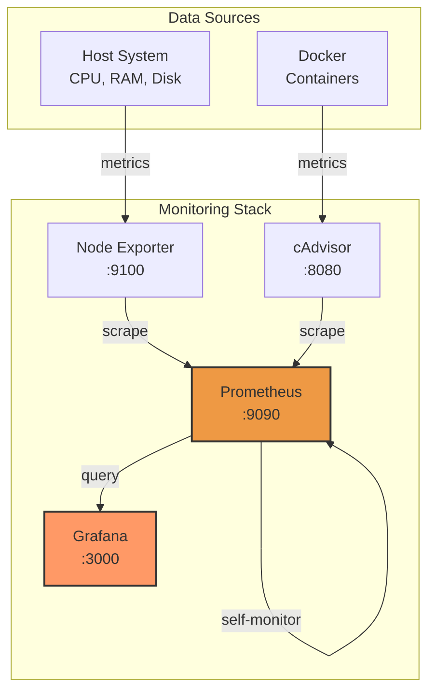

# Monitoring & Observability

## Overview

This homelab includes a **production-grade monitoring stack** with **Prometheus, Grafana, and AlertManager**, providing real-time metrics, dashboards, and **automated alerting with Slack integration** for full infrastructure observability.

## Stack Components

### Prometheus
- **Time-series database** for metrics collection
- Scrapes metrics from multiple exporters every 15 seconds
- 15-day data retention
- HTTP API for querying metrics
- **Alert rule evaluation** with 15+ production-ready alerts

### Grafana
- **Visualization platform** for metrics dashboards
- Pre-configured Prometheus datasource
- Auto-provisioned dashboards
- Dark theme by default
- Supports importing from grafana.com

### AlertManager
- **Alert routing and notification** system
- Slack integration for critical/warning alerts
- Alert grouping and inhibition rules
- Silencing and acknowledgment support
- Production-ready alert receiver configuration

### Node Exporter
- Exports **host system metrics**: CPU, memory, disk I/O, network
- Runs in host network mode for accurate data collection
- Deployed to remote hosts via Ansible automation

### cAdvisor
- **Container metrics** for Docker
- Resource usage, performance characteristics, and running containers
- Built-in web UI

## Quick Start

```bash
# From repo root
make mon-up

# Access services
# Grafana:       http://localhost:3001
# Prometheus:    http://localhost:9090
# AlertManager:  http://localhost:9093
# cAdvisor:      http://localhost:8080
```

Default Grafana credentials: `admin` / (set in `.env` - use Ansible Vault in production)

## Architecture



## Configuration

### Environment Variables

Create `.env` from `.env.example`:

```bash
cd docker/monitoring-stack
cp .env.example .env
```

Key variables:
- `GF_SECURITY_ADMIN_PASSWORD` - Grafana admin password (required)
- `GRAFANA_PORT` - Grafana web port (default: 3000)
- `PROMETHEUS_PORT` - Prometheus web port (default: 9090)

### Prometheus Scrape Targets

Edit `prometheus/prometheus.yml` to add new scrape targets:

```yaml
scrape_configs:
  - job_name: my_service
    static_configs:
      - targets: ["service:port"]
```

Reload configuration:
```bash
curl -X POST http://localhost:9090/-/reload
```

### Adding Grafana Dashboards

1. **Manual import** via Grafana UI:
   - Navigate to Dashboards → Import
   - Enter dashboard ID from [grafana.com/dashboards](https://grafana.com/grafana/dashboards/)
   - Select Prometheus datasource

2. **Auto-provision** (recommended):
   ```bash
   # Download dashboard JSON
   curl -o grafana/provisioning/dashboards/node-exporter-full.json \
     https://grafana.com/api/dashboards/1860/revisions/latest/download
   
   # Restart Grafana
   docker compose restart grafana
   ```

**Recommended dashboards:**
- [Node Exporter Full](https://grafana.com/grafana/dashboards/1860) - System metrics
- [Docker & System Monitoring](https://grafana.com/grafana/dashboards/179) - Container metrics
- [cAdvisor](https://grafana.com/grafana/dashboards/893) - Container resource usage

## Monitoring Your Infrastructure

### Viewing Metrics

**Prometheus Expression Browser:**
- Navigate to http://localhost:9090
- Use PromQL to query metrics:
  ```promql
  # CPU usage
  rate(node_cpu_seconds_total{mode="idle"}[5m])
  
  # Memory usage
  node_memory_MemAvailable_bytes / node_memory_MemTotal_bytes
  
  # Container CPU usage
  rate(container_cpu_usage_seconds_total[5m])
  ```

**Grafana Dashboards:**
- Navigate to http://localhost:3000
- Explore → Dashboards
- View pre-configured or imported dashboards

### Setting Up Alerts

**Production-Ready Alert Rules Included:**

The monitoring stack comes with 15+ pre-configured alert rules in `prometheus/rules/alerts.yml`:

**System Alerts:**

- `NodeExporterDown` - Node exporter service failure (critical)
- `HighCPUUsage` - CPU usage >80% for 5 minutes (warning)
- `HighMemoryUsage` - Memory usage >90% for 5 minutes (critical)
- `DiskSpaceLow` - Disk space <15% (critical)
- `DiskSpaceWarning` - Disk space <25% (warning)

**Container Alerts:**

- `ContainerDown` - cAdvisor monitoring failure (critical)
- `ContainerHighMemory` - Container using >90% of memory limit (warning)

**Service Alerts:**

- `PrometheusDown` - Prometheus self-monitoring failure (critical)
- `PrometheusTargetDown` - Any scrape target unreachable (warning)
- `GrafanaDown` - Grafana dashboard unavailable (warning)

Each alert includes:

- ✅ **Runbook commands** for quick troubleshooting
- ✅ **Severity labels** (critical/warning)
- ✅ **Clear descriptions** of the issue
- ✅ **Threshold tuning** based on best practices

**AlertManager Configuration:**

Configure Slack notifications in `alertmanager/alertmanager.yml`:

```yaml
receivers:
  - name: 'slack-critical'
    slack_configs:
      - api_url: 'YOUR_SLACK_WEBHOOK_URL'
        channel: '#homelab-critical'
```

See `docker/monitoring-stack/alertmanager/README.md` for complete setup guide.

**Custom Alert Rules:**

Add your own rules in `prometheus/alert_rules.yml`:

```yaml
groups:
  - name: system_alerts
    interval: 30s
    rules:
      - alert: HighCPUUsage
        expr: 100 - (avg by (instance) (rate(node_cpu_seconds_total{mode="idle"}[5m])) * 100) > 80
        for: 5m
        labels:
          severity: warning
        annotations:
          summary: "High CPU usage detected"
```

## CI/CD Integration

The monitoring stack includes automated validation in GitHub Actions:

```yaml
docker_compose:
  runs-on: ubuntu-latest
  steps:
    - uses: actions/checkout@v4
    - name: Validate monitoring docker-compose
      run: docker compose -f docker/monitoring-stack/docker-compose.yml config
```

This ensures:
- ✅ Docker Compose syntax is valid
- ✅ Service definitions are correct
- ✅ Volume and network configurations are valid

## Operations

### Starting/Stopping

```bash
# Start
make mon-up

# Stop
make mon-down

# View logs
make mon-logs
```

### Backup & Restore

**Backup Prometheus data:**
```bash
docker run --rm -v monitoring-stack_prometheus_data:/data \
  -v $(pwd):/backup alpine tar czf /backup/prometheus-backup.tar.gz -C /data .
```

**Backup Grafana dashboards:**
```bash
docker run --rm -v monitoring-stack_grafana_data:/data \
  -v $(pwd):/backup alpine tar czf /backup/grafana-backup.tar.gz -C /data .
```

**Restore:**
```bash
docker run --rm -v monitoring-stack_prometheus_data:/data \
  -v $(pwd):/backup alpine tar xzf /backup/prometheus-backup.tar.gz -C /data
```

### Troubleshooting

**Check service health:**
```bash
docker compose ps
```

**View logs:**
```bash
# All services
make mon-logs

# Specific service
docker compose logs -f prometheus
```

**Verify Prometheus targets:**
- Navigate to http://localhost:9090/targets
- All targets should show "UP" status

**Reset all data:**
```bash
make mon-down
docker volume rm monitoring-stack_prometheus_data monitoring-stack_grafana_data
make mon-up
```

## Network Security

### Firewall Configuration

If accessing from remote machines (Fedora/RHEL):

```bash
sudo firewall-cmd --add-port=3000/tcp --permanent  # Grafana
sudo firewall-cmd --add-port=9090/tcp --permanent  # Prometheus
sudo firewall-cmd --reload
```

### Production Considerations

For production deployments:

1. **Use HTTPS:** Place Nginx reverse proxy in front
2. **Authentication:** Enable Grafana LDAP/OAuth
3. **Network isolation:** Use Docker networks properly
4. **Secrets management:** Use Docker secrets instead of `.env`
5. **Persistent storage:** Use bind mounts with backup strategy
6. **Alerting:** Configure Alertmanager for notifications

## Extending the Stack

### Adding Remote Targets

To monitor remote hosts, install Node Exporter as a systemd service:

```yaml
# See ansible/roles/monitoring role (future addition)
# Will deploy node_exporter to remote hosts via Ansible
```

### Integration with Other Services

Add scrape configs for:
- **Nginx:** nginx-prometheus-exporter
- **PostgreSQL:** postgres_exporter
- **Redis:** redis_exporter
- **Custom apps:** Prometheus client libraries

Example:
```yaml
scrape_configs:
  - job_name: nginx
    static_configs:
      - targets: ["nginx-exporter:9113"]
```

### Deploying Node Exporter to Remote Hosts

Use the included Ansible role to automatically deploy node_exporter:

```bash
# Deploy to all managed hosts
cd ansible
ansible-playbook playbooks/deploy-monitoring.yml

# Generate Prometheus targets from inventory
python3 ../scripts/generate_prometheus_targets.py inventories/hosts
```

This installs node_exporter as a systemd service with:

- ✅ Automatic firewall configuration
- ✅ Security hardening
- ✅ Health check verification

See the [monitoring role on GitHub](https://github.com/iso-st3ph/homelab-devops/tree/main/ansible/roles/monitoring) for details.

## References

- [Prometheus Documentation](https://prometheus.io/docs/)
- [Grafana Documentation](https://grafana.com/docs/)
- [Node Exporter](https://github.com/prometheus/node_exporter)
- [cAdvisor](https://github.com/google/cadvisor)
- [PromQL Basics](https://prometheus.io/docs/prometheus/latest/querying/basics/)

## Next Steps

- [x] **Production AlertManager with Slack** ✅
- [x] **15+ Alert rules with runbooks** ✅
- [x] **Deploy node_exporter to remote hosts via Ansible** ✅
- [x] **Secrets management with Ansible Vault** ✅
- [x] **Automated backup/restore scripts** ✅
- [ ] Import pre-built Grafana dashboards (Node Exporter Full, Docker)
- [ ] Configure Nginx reverse proxy with SSL
- [ ] Log aggregation with Loki + Promtail
- [ ] Distributed tracing with Tempo
