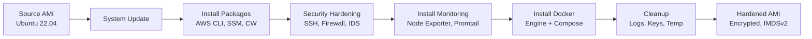

# Packer Automated Image Builds

Automated AMI builds with comprehensive security hardening, monitoring tools, and Docker using HashiCorp Packer.

## 🎯 Overview

This implementation demonstrates **immutable infrastructure** through automated machine image builds. Rather than provisioning instances with user_data scripts, we pre-bake hardened AMIs with all required tools and configurations.

### Benefits

- ✅ **Faster Boot Times** - No runtime provisioning needed
- ✅ **Consistency** - Identical configuration across all instances
- ✅ **Security** - Hardening applied at image level
- ✅ **Version Control** - Timestamped AMIs enable rollback
- ✅ **Immutability** - Infrastructure as code for machine images

## 🏗️ Architecture

The build process follows a multi-stage provisioning workflow:



## 📦 What's Included

### Base: Ubuntu 22.04 LTS

Official Canonical AMI with:
- Latest security patches
- EBS encryption enabled
- IMDSv2 enforced

### Security Hardening

**SSH Configuration**:
- Root login disabled
- Password authentication disabled
- Key-only authentication (PubkeyAuthentication)
- Protocol 2 only
- Connection limits (MaxAuthTries: 3, MaxSessions: 2)
- Client timeouts configured

**Firewall (UFW)**:
- Default deny incoming traffic
- Default allow outgoing traffic
- SSH port 22 allowed
- Enabled and active on boot

**fail2ban**:
- SSH brute-force protection
- 5 attempts allowed in 10 minutes
- 1-hour ban time
- Configured and running

**Kernel Hardening (sysctl)**:
- IP forwarding disabled
- SYN flood protection enabled
- ICMP redirects ignored
- Source routing disabled
- Martian packet logging
- Reverse path filtering enabled

**Additional Security**:
- **ClamAV**: Antivirus with automatic signature updates
- **AIDE**: Advanced Intrusion Detection Environment
- **Unattended Upgrades**: Automatic security patches
- Secure file permissions (/etc/passwd, /etc/shadow, grub)

### AWS Integration

- **AWS CLI v2**: Latest command-line interface
- **SSM Agent**: Remote management without SSH
- **CloudWatch Agent**: Metrics and log shipping to CloudWatch

### Monitoring Stack

- **Prometheus Node Exporter**: 
  - System metrics (CPU, RAM, disk, network)
  - Systemd integration
  - Process collector enabled
  - Exposed on port 9100

- **Promtail**:
  - Log shipping to Loki
  - Configured for /var/log/*log
  - Systemd service enabled
  - Port 9080

### Container Runtime

- **Docker Engine**: Latest stable from official repository
- **Docker Compose v2**: Plugin and standalone binary
- **Daemon Hardening**:
  - JSON file logging with rotation (10MB max, 3 files)
  - Live restore enabled
  - Metrics endpoint (127.0.0.1:9323)
  - Userland proxy disabled for performance

### Developer Tools

Essential CLI utilities:
- curl, wget, git, vim, htop
- jq (JSON processor)
- Python 3 with pip
- Build essentials (gcc, make)
- net-tools, unzip, ca-certificates

## 🚀 Quick Start

### Prerequisites

```bash
# Install Packer
brew install packer  # macOS
# or use our build.sh script (auto-installs)

# Configure AWS credentials
export AWS_ACCESS_KEY_ID="your-key"
export AWS_SECRET_ACCESS_KEY="your-secret"
export AWS_DEFAULT_REGION="us-east-1"
```

### Build Process

```bash
cd packer

# Copy variables template
cp variables.pkrvars.hcl.example variables.auto.pkrvars.hcl

# Edit configuration
vim variables.auto.pkrvars.hcl

# Initialize Packer plugins
packer init aws-ubuntu.pkr.hcl

# Validate template
packer validate -var-file=variables.auto.pkrvars.hcl aws-ubuntu.pkr.hcl

# Build AMI (~15 minutes)
packer build -var-file=variables.auto.pkrvars.hcl aws-ubuntu.pkr.hcl
```

### Makefile Commands

```bash
make packer-init      # Initialize plugins
make packer-validate  # Validate template
make packer-build     # Build AMI (requires confirmation)
make packer-clean     # Clean artifacts
```

## ⚙️ Configuration

### Variables

`variables.auto.pkrvars.hcl`:

```hcl
ami_name        = "homelab-ubuntu-22.04"
ami_description = "Ubuntu 22.04 with security hardening"
region          = "us-east-1"
instance_type   = "t3.micro"

# Optional: Build in specific VPC/Subnet
# vpc_id    = "vpc-xxxxx"
# subnet_id = "subnet-xxxxx"

ssh_username = "ubuntu"
```

### Customization

Modify provisioning scripts in `packer/scripts/`:

- Add packages: `02-install-packages.sh`
- Custom security: `03-security-hardening.sh`
- Additional monitoring: `04-install-monitoring.sh`
- Remove Docker: Comment out in template

## 🔗 Terraform Integration

### Use Custom AMI

```hcl
# Data source to find latest AMI
data "aws_ami" "homelab_ubuntu" {
  most_recent = true
  owners      = ["self"]

  filter {
    name   = "name"
    values = ["homelab-ubuntu-22.04-*"]
  }

  filter {
    name   = "state"
    values = ["available"]
  }
}

# Launch instance from custom AMI
resource "aws_instance" "server" {
  ami           = data.aws_ami.homelab_ubuntu.id
  instance_type = "t3.micro"
  key_name      = var.key_name

  # No user_data needed - everything pre-installed!
  
  tags = {
    Name = "Hardened Ubuntu Server"
  }
}
```

### Benefits

- **Faster Launch**: No provisioning scripts to run
- **Consistency**: Same configuration every time
- **Reliability**: Pre-tested image
- **Rollback**: Easy to revert to previous AMI version

## 📊 Build Output

```text
==> amazon-ebs.ubuntu: Creating temporary keypair
==> amazon-ebs.ubuntu: Launching source instance...
==> amazon-ebs.ubuntu: Waiting for instance to become ready...
==> amazon-ebs.ubuntu: Connected to SSH!
==> amazon-ebs.ubuntu: Provisioning with shell script: 01-system-update.sh
==> amazon-ebs.ubuntu: Provisioning with shell script: 02-install-packages.sh
==> amazon-ebs.ubuntu: Provisioning with shell script: 03-security-hardening.sh
==> amazon-ebs.ubuntu: Provisioning with shell script: 04-install-monitoring.sh
==> amazon-ebs.ubuntu: Provisioning with shell script: 05-install-docker.sh
==> amazon-ebs.ubuntu: Provisioning with shell script: 99-cleanup.sh
==> amazon-ebs.ubuntu: Stopping source instance...
==> amazon-ebs.ubuntu: Creating AMI...
==> amazon-ebs.ubuntu: AMI: ami-0123456789abcdef0
==> amazon-ebs.ubuntu: Terminating source instance...
==> amazon-ebs.ubuntu: Deleting temporary keypair...

Build finished. The artifacts of successful builds are:
--> amazon-ebs.ubuntu: AMIs were created:
us-east-1: ami-0123456789abcdef0
```

## ✅ Validation

### Test Instance

```bash
# Launch from custom AMI
aws ec2 run-instances \
  --image-id ami-0123456789abcdef0 \
  --instance-type t3.micro \
  --key-name your-key

# Connect via SSM (no SSH key needed!)
aws ssm start-session --target i-xxxxx

# Or traditional SSH
ssh ubuntu@<public-ip>
```

### Verify Components

```bash
# Security
sudo ufw status
sudo fail2ban-client status
freshclam --version

# Monitoring
systemctl status node_exporter
systemctl status promtail
curl localhost:9100/metrics

# Docker
docker --version
docker compose version

# AWS Tools
aws --version
/snap/bin/amazon-ssm-agent --version
```

## 🎓 Skills Demonstrated

- ✅ **Packer**: HCL2 templates, multi-stage builds
- ✅ **Security**: SSH hardening, firewall, IDS, antivirus
- ✅ **Automation**: Shell scripting, systemd services
- ✅ **AWS**: CLI, SSM, CloudWatch, IMDSv2, encryption
- ✅ **Monitoring**: Prometheus exporters, Loki integration
- ✅ **Containers**: Docker installation and hardening
- ✅ **Immutable Infrastructure**: Image-based deployments
- ✅ **DevOps Best Practices**: Version control, repeatability

## 📚 Resources

- Full template: `packer/aws-ubuntu.pkr.hcl`
- Provisioning scripts: `packer/scripts/`
- README: `packer/README.md`
- [Packer Documentation](https://www.packer.io/docs)
- [Amazon EBS Builder](https://www.packer.io/docs/builders/amazon/ebs)

---

Built by [Stephon Skipper](https://www.linkedin.com/in/stephon-skipper/) | [GitHub](https://github.com/iso-st3ph/homelab-devops)
