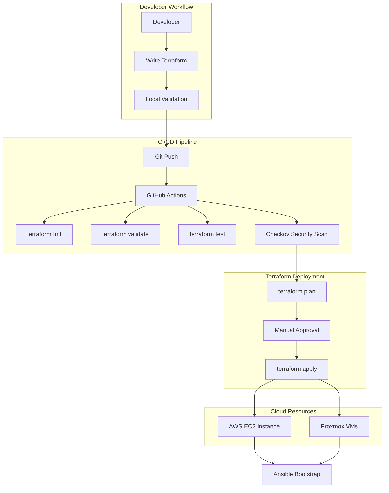

# Terraform Infrastructure

Infrastructure as Code (IaC) for provisioning cloud resources on **AWS** and **Proxmox** using HashiCorp Terraform.

## 🎯 Overview

This implementation demonstrates production-ready Terraform practices including:

- ✅ **Reusable Modules** - DRY principle with ec2_minimal module
- ✅ **Built-in Testing** - Terraform test framework for validation
- ✅ **Security Hardening** - IMDSv2, encryption, no hardcoded credentials
- ✅ **Multi-Environment** - Workspaces for dev/staging/prod
- ✅ **State Management** - Remote state with S3 backend support
- ✅ **CI/CD Integration** - Automated validation in pipelines

## 🏗️ Architecture



## ✅ Components Managed

| Platform | Resources | Notes |
|----------|-----------|-------|
| **AWS** | EC2 Instance, Security Groups, EBS Volumes | IMDSv2 enforced, encrypted volumes, SSM enabled |
| **Proxmox** | Virtual Machines | Terraform provider integration with local homelab |

## � Repository Structure

```
terraform/
├── aws-ec2/                    # AWS EC2 deployment
│   ├── main.tf                 # EC2 instance configuration
│   ├── variables.tf            # Input variables
│   ├── outputs.tf              # Output values
│   └── versions.tf             # Provider versions
│
└── modules/
    └── ec2_minimal/            # Reusable EC2 module
        ├── main.tf             # Module logic
        ├── variables.tf        # Module inputs
        ├── outputs.tf          # Module outputs
        ├── versions.tf         # Required providers
        └── tests/
            └── ec2_minimal.tftest.hcl  # Module tests
```

## 🚀 Quick Start

### Prerequisites

```bash
# Install Terraform
brew install terraform  # macOS
# or
wget https://releases.hashicorp.com/terraform/1.9.5/terraform_1.9.5_linux_amd64.zip
unzip terraform_1.9.5_linux_amd64.zip
sudo mv terraform /usr/local/bin/

# Verify installation
terraform version
```

### Deploy Infrastructure

```bash
cd terraform/aws-ec2

# Initialize Terraform
terraform init

# Validate configuration
terraform validate

# Format code
terraform fmt -recursive

# Preview changes
terraform plan

# Apply infrastructure
terraform apply

# Destroy when done
terraform destroy
```

## 🔧 Configuration

### AWS EC2 Module

**Key Features**:

- **IMDSv2 Enforcement**: Metadata service hardening
- **EBS Encryption**: At-rest encryption for volumes
- **SSM Integration**: Remote management without SSH keys
- **Security Groups**: Restricted ingress/egress rules
- **User Data**: Cloud-init for initial bootstrapping
- **Tags**: Comprehensive resource tagging

**Example Usage**:

```hcl
module "ec2" {
  source = "./modules/ec2_minimal"

  instance_name = "web-server"
  instance_type = "t3.micro"
  ami_id        = "ami-0c55b159cbfafe1f0"
  
  vpc_id    = "vpc-xxxxx"
  subnet_id = "subnet-xxxxx"
  
  enable_ssm         = true
  enable_encryption  = true
  enable_monitoring  = true
  
  tags = {
    Environment = "production"
    ManagedBy   = "Terraform"
  }
}
```

### Variables

Edit `variables.tf` or create `terraform.tfvars`:

```hcl
# AWS Configuration
region        = "us-east-1"
instance_type = "t3.micro"
instance_name = "homelab-server"

# Security
enable_ssm        = true
enable_encryption = true

# Networking
vpc_id    = "vpc-xxxxx"
subnet_id = "subnet-xxxxx"

# Tags
tags = {
  Environment = "dev"
  Project     = "homelab"
}
```

## 🧪 Testing

### Module Tests

```bash
cd terraform/modules/ec2_minimal

# Initialize for testing
terraform init -backend=false

# Run tests
terraform test

# Expected output:
# Success! 3 passed, 0 failed.
```

### Test Coverage

- ✅ IMDSv2 enabled
- ✅ EBS encryption enabled
- ✅ Proper tagging applied
- ✅ Security group validation
- ✅ SSM IAM role attached

## 🔐 Security Features

### Checkov Compliance

All configurations pass Checkov security scanning:

```bash
checkov -d terraform/
```

**Implemented Controls**:

| Feature | Status | Description |
|---------|--------|-------------|
| **IMDSv2 Enforced** | ✅ | Metadata v2 required, prevents SSRF attacks |
| **EBS Encrypted** | ✅ | At-rest encryption for all volumes |
| **No Hardcoded Credentials** | ✅ | Uses AWS provider authentication |
| **SSM IAM Role** | ✅ | Remote access without SSH keys |
| **Security Groups** | ✅ | Restricted ingress rules |
| **Resource Tagging** | ✅ | All resources properly tagged |

### IMDSv2 Configuration

```hcl
metadata_options {
  http_endpoint               = "enabled"
  http_tokens                 = "required"
  http_put_response_hop_limit = 1
  instance_metadata_tags      = "enabled"
}
```

### EBS Encryption

```hcl
root_block_device {
  encrypted   = true
  volume_size = 20
  volume_type = "gp3"
  
  delete_on_termination = true
}
```

## 🌍 Multi-Environment Management

### Terraform Workspaces

```bash
# Create environments
terraform workspace new dev
terraform workspace new staging
terraform workspace new prod

# Switch environments
terraform workspace select dev

# List workspaces
terraform workspace list

# Deploy to specific environment
terraform apply -var-file=env/dev.tfvars
```

### Environment-Specific Variables

```
terraform/
└── aws-ec2/
    ├── main.tf
    └── env/
        ├── dev.tfvars
        ├── staging.tfvars
        └── prod.tfvars
```

## 📊 Outputs

After successful deployment:

```bash
terraform output

# Example outputs:
public_ip    = "54.123.45.67"
instance_id  = "i-0abc123def456789"
private_ip   = "10.0.1.50"
```

### Using Outputs

```bash
# Get specific output
terraform output -raw public_ip

# SSH to instance
ssh ubuntu@$(terraform output -raw public_ip)

# Use in scripts
INSTANCE_ID=$(terraform output -raw instance_id)
aws ec2 describe-instances --instance-ids $INSTANCE_ID
```

## 🔄 CI/CD Integration

### GitHub Actions Workflow

Automated validation on every push:

```yaml
name: Terraform CI

on: [push, pull_request]

jobs:
  terraform:
    runs-on: ubuntu-latest
    steps:
      - uses: actions/checkout@v4
      
      - name: Setup Terraform
        uses: hashicorp/setup-terraform@v3
      
      - name: Terraform Format
        run: terraform fmt -check -recursive
      
      - name: Terraform Init
        run: terraform init -backend=false
      
      - name: Terraform Validate
        run: terraform validate
      
      - name: Terraform Test
        run: terraform test
      
      - name: Security Scan
        run: checkov -d terraform/
```

### Jenkins Pipeline

```groovy
stage('Terraform Validation') {
  steps {
    container('terraform') {
      sh '''
        terraform init -backend=false
        terraform validate
        terraform fmt -check
      '''
    }
  }
}

stage('Terraform Test') {
  steps {
    container('terraform') {
      sh 'terraform test'
    }
  }
}
```

## 🔗 Integration with Ansible

### Cloud-Init Bootstrap

Terraform provisions instances with cloud-init that triggers Ansible:

```hcl
user_data = <<-EOF
  #!/bin/bash
  # Install Ansible
  apt-add-repository ppa:ansible/ansible -y
  apt-get update
  apt-get install -y ansible
  
  # Run Ansible playbook
  ansible-pull -U https://github.com/user/ansible-repo
EOF
```

### Inventory Generation

```bash
# Generate Ansible inventory from Terraform outputs
terraform output -json | jq -r '.instance_ips.value[]' > ansible/inventory.ini
```

## 🔗 Integration with Packer

### Use Custom AMI

```hcl
# Data source to find Packer-built AMI
data "aws_ami" "homelab_ubuntu" {
  most_recent = true
  owners      = ["self"]

  filter {
    name   = "name"
    values = ["homelab-ubuntu-22.04-*"]
  }
}

# Use in EC2 instance
resource "aws_instance" "server" {
  ami = data.aws_ami.homelab_ubuntu.id
  
  # All security hardening pre-baked!
  # No user_data provisioning needed
}
```

## 📚 Best Practices Implemented

- ✅ **Module Reusability**: DRY principle with ec2_minimal module
- ✅ **Version Pinning**: Provider versions locked
- ✅ **State Locking**: Prevent concurrent modifications
- ✅ **Sensitive Data**: Using sensitive = true for outputs
- ✅ **Resource Naming**: Consistent naming conventions
- ✅ **Tagging Strategy**: All resources tagged
- ✅ **Documentation**: Inline comments and README
- ✅ **Testing**: Automated tests for modules

## 🎓 Skills Demonstrated

- ✅ **Terraform HCL**: Resource blocks, modules, data sources
- ✅ **Module Development**: Reusable, testable components
- ✅ **Testing Framework**: terraform test for validation
- ✅ **Security Hardening**: IMDSv2, encryption, least privilege
- ✅ **CI/CD Integration**: Automated validation pipelines
- ✅ **Multi-Environment**: Workspace management
- ✅ **State Management**: Backend configuration
- ✅ **AWS Services**: EC2, VPC, IAM, security groups

## 📖 References

- Code: `terraform/aws-ec2/`
- Module: `terraform/modules/ec2_minimal/`
- Tests: `terraform/modules/ec2_minimal/tests/`
- [Terraform Documentation](https://www.terraform.io/docs)
- [AWS Provider](https://registry.terraform.io/providers/hashicorp/aws/latest/docs)

---

Built by [Stephon Skipper](https://www.linkedin.com/in/stephon-skipper/) | [GitHub](https://github.com/iso-st3ph/homelab-devops)

