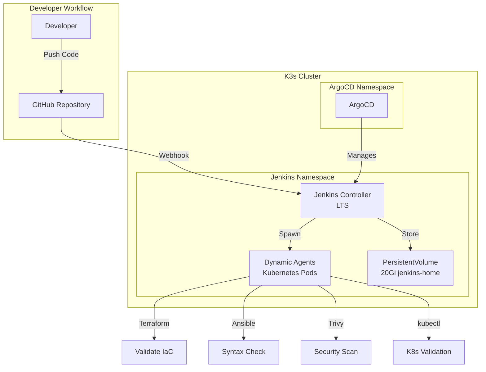

# Jenkins on Kubernetes

Jenkins CI/CD server deployed on K3s with Kubernetes plugin for dynamic agent provisioning.

## 🏗️ Architecture



## 📦 Components

### Jenkins Controller
- **Image**: `jenkins/jenkins:lts`
- **Resources**: 500m CPU / 1Gi RAM (request), 2 CPU / 3Gi RAM (limit)
- **Storage**: 20Gi PersistentVolumeClaim
- **Access**: NodePort 30808
- **Configuration**: Jenkins Configuration as Code (JCasC)

### Kubernetes Plugin
- **Dynamic Agent Provisioning**: Spawn pods on-demand
- **Resource Limits**: 500m CPU / 512Mi RAM per agent
- **Auto-cleanup**: Agents destroyed after job completion
- **Container Images**: Terraform, Ansible, Trivy, kubectl

### RBAC
- **ServiceAccount**: `jenkins` in `jenkins` namespace
- **ClusterRole**: Permissions for pod/secret/configmap management
- **Scope**: Create/delete pods, access logs, manage secrets

## 🚀 Deployment

### Option 1: Manual Deployment

```bash
cd kubernetes/jenkins

# Deploy all manifests
./deploy.sh

# Or manually apply
kubectl apply -f .
```

### Option 2: GitOps with ArgoCD

```bash
# Apply ArgoCD Application
kubectl apply -f ../../argocd/jenkins-app.yaml

# Check sync status
kubectl get application jenkins -n argocd
```

## 🔐 Initial Setup

### Get Admin Password

```bash
# Wait for pod to be ready
kubectl wait --for=condition=ready pod -l app=jenkins -n jenkins --timeout=300s

# Get initial admin password
JENKINS_POD=$(kubectl get pods -n jenkins -l app=jenkins -o jsonpath='{.items[0].metadata.name}')
kubectl exec -n jenkins $JENKINS_POD -- cat /var/jenkins_home/secrets/initialAdminPassword
```

### Access UI

```
URL: http://localhost:30808
Username: admin
Password: <from command above>
```

### Install Suggested Plugins

On first login:
1. Select "Install suggested plugins"
2. Wait for installation to complete
3. Create first admin user (or skip and continue as admin)

### Required Plugins

The following plugins are needed for the Jenkinsfile:

- **Kubernetes Plugin** (pre-configured via JCasC)
- **Pipeline Plugin** (included in suggested plugins)
- **Git Plugin** (included in suggested plugins)
- **Credentials Plugin** (included in suggested plugins)

## 📋 Pipeline Overview

The `Jenkinsfile` in the repository root demonstrates:

### Kubernetes-based Agents

Dynamic pod creation with specialized containers:
- `terraform` - HashiCorp Terraform latest
- `ansible` - Ansible with dependencies
- `trivy` - Aqua Security scanner
- `kubectl` - Kubernetes CLI

### Pipeline Stages

1. **Checkout** - Clone repository
2. **Terraform Validation** - Format check, validate, init
3. **Terraform Test** - Run module tests
4. **Ansible Syntax Check** - Validate playbooks
5. **Security Scan - IaC** - Trivy config scanning
6. **Security Scan - Images** - Trivy container image scanning
7. **Kubernetes Validation** - kubectl dry-run validation
8. **Summary** - Report results

### Example Pipeline Run

```groovy
pipeline {
  agent {
    kubernetes {
      yaml '''
        # Pod specification with terraform, ansible, trivy containers
      '''
    }
  }
  stages {
    stage('Terraform Validation') {
      steps {
        container('terraform') {
          sh 'terraform validate'
        }
      }
    }
  }
}
```

## 🎛️ Configuration

### Jenkins Configuration as Code (JCasC)

The `jenkins.yaml` ConfigMap provides:

```yaml
jenkins:
  systemMessage: "Jenkins - DevOps Portfolio CI/CD Server"
  numExecutors: 0  # All jobs run on Kubernetes agents
  clouds:
    - kubernetes:
        name: "kubernetes"
        serverUrl: "https://kubernetes.default"
        namespace: "jenkins"
        containerCapStr: "10"  # Max 10 concurrent agents
```

### Resource Limits

**Controller**:
- Request: 500m CPU, 1Gi RAM
- Limit: 2 CPU, 3Gi RAM

**Agents** (per pod):
- Request: 500m CPU, 512Mi RAM
- Limit: 1 CPU, 1Gi RAM

### Storage

- **Volume**: PersistentVolumeClaim `jenkins-home`
- **Capacity**: 20Gi
- **StorageClass**: `local-path` (K3s default)
- **Mount**: `/var/jenkins_home`

## 📊 Monitoring

### Pod Status

```bash
kubectl get pods -n jenkins
kubectl describe pod -n jenkins <pod-name>
```

### Logs

```bash
# Controller logs
kubectl logs -n jenkins -l app=jenkins -f

# Agent logs (during job)
kubectl logs -n jenkins <agent-pod-name> -c <container-name>
```

### Service Endpoints

```bash
kubectl get svc -n jenkins
```

## 🔧 Operations

### Restart Jenkins

```bash
kubectl rollout restart deployment/jenkins -n jenkins
kubectl rollout status deployment/jenkins -n jenkins
```

### Update Configuration

Edit ConfigMap and restart:

```bash
kubectl edit configmap jenkins-config -n jenkins
kubectl rollout restart deployment/jenkins -n jenkins
```

### Scale (not recommended)

Jenkins runs as a single replica (stateful):

```bash
# Don't scale replicas - use Kubernetes agents instead
kubectl scale deployment jenkins -n jenkins --replicas=1
```

### Backup Jenkins Home

```bash
# Copy from PVC
JENKINS_POD=$(kubectl get pods -n jenkins -l app=jenkins -o jsonpath='{.items[0].metadata.name}')
kubectl exec -n jenkins $JENKINS_POD -- tar czf /tmp/jenkins-backup.tar.gz /var/jenkins_home
kubectl cp jenkins/$JENKINS_POD:/tmp/jenkins-backup.tar.gz ./jenkins-backup-$(date +%Y%m%d).tar.gz
```

## 🛠️ Troubleshooting

### Pod Not Starting

```bash
kubectl describe pod -n jenkins <pod-name>
kubectl logs -n jenkins <pod-name>
```

Common issues:
- PVC not bound (check storage class)
- Resource limits too low
- Image pull errors

### Agents Not Spawning

Check:
1. ServiceAccount has correct RBAC
2. Kubernetes plugin configured (via JCasC)
3. Jenkins URL accessible from pods
4. Container images available

```bash
kubectl get sa jenkins -n jenkins
kubectl describe clusterrole jenkins
```

### UI Not Accessible

```bash
# Check service
kubectl get svc jenkins -n jenkins

# Check NodePort
kubectl describe svc jenkins -n jenkins | grep NodePort

# Port forward as alternative
kubectl port-forward -n jenkins svc/jenkins 8080:8080
```

## 🎓 Skills Demonstrated

- ✅ **Jenkins on Kubernetes** - Cloud-native CI/CD
- ✅ **Dynamic Agent Provisioning** - Kubernetes plugin
- ✅ **Jenkins Configuration as Code** - JCasC
- ✅ **Declarative Pipelines** - Groovy-based Jenkinsfile
- ✅ **Multi-stage Pipelines** - Validate, test, scan
- ✅ **Container-based Jobs** - Specialized tooling per stage
- ✅ **Security Integration** - Trivy scanning in pipeline
- ✅ **GitOps Management** - ArgoCD managing Jenkins
- ✅ **RBAC** - Kubernetes service account permissions
- ✅ **Persistent Storage** - PVC for Jenkins data

## 📚 References

- [Jenkins on Kubernetes](https://www.jenkins.io/doc/book/installing/kubernetes/)
- [Kubernetes Plugin](https://plugins.jenkins.io/kubernetes/)
- [Jenkins Configuration as Code](https://www.jenkins.io/projects/jcasc/)
- [Pipeline Syntax](https://www.jenkins.io/doc/book/pipeline/syntax/)

---

Built by [Stephon Skipper](https://www.linkedin.com/in/stephon-skipper/) | [GitHub](https://github.com/iso-st3ph/homelab-devops)
