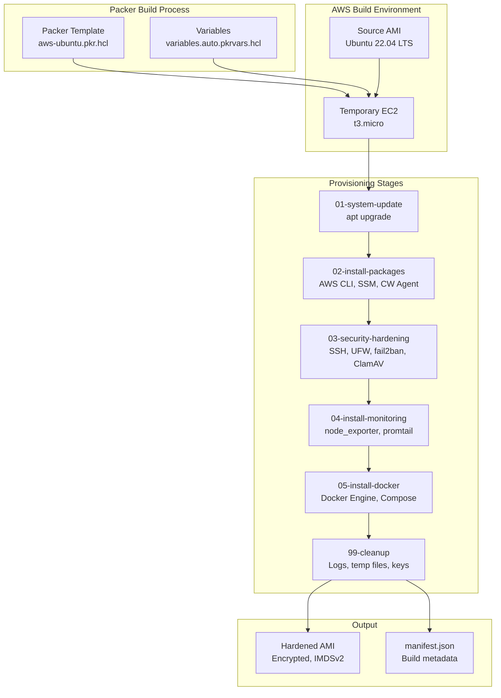

# Packer Image Builds

Automated AMI builds with security hardening, monitoring tools, and Docker using HashiCorp Packer.

## 🏗️ Architecture



## 📦 What's Included

### Base Image: Ubuntu 22.04 LTS

**Security Hardening**:
- ✅ Automatic security updates enabled
- ✅ SSH hardened (no root login, key-only auth, protocol 2)
- ✅ UFW firewall configured (deny incoming, allow SSH)
- ✅ fail2ban installed and configured
- ✅ Kernel hardening via sysctl (IP forwarding disabled, SYN cookies, etc.)
- ✅ ClamAV antivirus installed
- ✅ AIDE intrusion detection system
- ✅ Secure file permissions
- ✅ IMDSv2 enforced
- ✅ EBS encryption enabled

**AWS Integration**:
- ✅ AWS CLI v2
- ✅ AWS SSM Agent (remote management)
- ✅ CloudWatch Agent (metrics and logs)

**Monitoring Tools**:
- ✅ Prometheus Node Exporter (system metrics)
- ✅ Promtail (log shipping to Loki)

**Container Runtime**:
- ✅ Docker Engine 27.x
- ✅ Docker Compose v2
- ✅ Docker daemon hardening (log rotation, metrics endpoint)

**Developer Tools**:
- curl, wget, git, vim, htop, jq, python3

## 🚀 Quick Start

### Prerequisites

```bash
# Install Packer (or use build.sh to auto-install)
brew install packer  # macOS
# or
wget https://releases.hashicorp.com/packer/1.11.2/packer_1.11.2_linux_amd64.zip
unzip packer_1.11.2_linux_amd64.zip
sudo mv packer /usr/local/bin/

# Configure AWS credentials
export AWS_ACCESS_KEY_ID="your-access-key"
export AWS_SECRET_ACCESS_KEY="your-secret-key"
export AWS_DEFAULT_REGION="us-east-1"

# Or use AWS CLI profile
aws configure
```

### Build AMI

```bash
cd packer

# Copy and edit variables
cp variables.pkrvars.hcl.example variables.auto.pkrvars.hcl
vim variables.auto.pkrvars.hcl

# Initialize Packer plugins
packer init aws-ubuntu.pkr.hcl

# Validate template
packer validate -var-file=variables.auto.pkrvars.hcl aws-ubuntu.pkr.hcl

# Build AMI
packer build -var-file=variables.auto.pkrvars.hcl aws-ubuntu.pkr.hcl

# Or use automated script
./build.sh
```

### Build Output

```
Build 'ubuntu-hardened' finished after 12 minutes 34 seconds.

==> Wait completed after 12 minutes 34 seconds

==> Builds finished. The artifacts of successful builds are:
--> ubuntu-hardened: AMIs were created:
us-east-1: ami-0123456789abcdef0

AMI: homelab-ubuntu-22.04-2025-11-02-1530
```

## ⚙️ Configuration

### Variables

Edit `variables.auto.pkrvars.hcl`:

```hcl
ami_name        = "homelab-ubuntu-22.04"
ami_description = "Custom description"
region          = "us-east-1"
instance_type   = "t3.micro"  # Build instance type

# Optional: Build in specific VPC/Subnet
vpc_id    = "vpc-xxxxx"
subnet_id = "subnet-xxxxx"

ssh_username = "ubuntu"
```

### Customization

**Add packages**: Edit `scripts/02-install-packages.sh`

```bash
sudo apt-get install -y your-package
```

**Additional hardening**: Edit `scripts/03-security-hardening.sh`

```bash
# Your custom security configurations
```

**Custom monitoring**: Edit `scripts/04-install-monitoring.sh`

```bash
# Install additional exporters or agents
```

## 📋 Provisioning Scripts

### 01-system-update.sh

- Updates package lists
- Upgrades all packages
- Dist-upgrade
- Cleanup

### 02-install-packages.sh

- Essential CLI tools (curl, wget, git, vim, htop, jq)
- AWS CLI v2
- AWS SSM Agent
- CloudWatch Agent
- Python 3 and pip
- Build essentials

### 03-security-hardening.sh

- **Unattended Upgrades**: Automatic security patches
- **SSH Hardening**: 
  - Disable root login
  - Key-only authentication
  - Protocol 2 only
  - Connection limits
- **Firewall (UFW)**: Default deny incoming, allow SSH
- **fail2ban**: SSH brute-force protection
- **Kernel Hardening**: sysctl parameters
  - SYN flood protection
  - Ignore ICMP redirects
  - Disable IP forwarding
  - Enable reverse path filtering
- **ClamAV**: Antivirus with automatic updates
- **AIDE**: Intrusion detection system
- **File Permissions**: Secure /etc/passwd, /etc/shadow, grub.cfg

### 04-install-monitoring.sh

- **Node Exporter**: System metrics (CPU, RAM, disk, network)
  - Systemd service enabled
  - Exposes metrics on :9100
- **Promtail**: Log shipping to Loki
  - Config template provided
  - Systemd service enabled

### 05-install-docker.sh

- Docker Engine from official repo
- Docker Compose v2
- Daemon configuration:
  - JSON file logging with rotation
  - Live restore enabled
  - Metrics endpoint on 127.0.0.1:9323
- User permissions (ubuntu in docker group)

### 99-cleanup.sh

- Clear package cache
- Remove SSH host keys (regenerated on boot)
- Clear cloud-init logs
- Truncate log files
- Remove temporary files
- Clear machine-id
- Clear bash history

## 🔄 Integration with Terraform

### Use Custom AMI

```hcl
# terraform/aws-ec2/main.tf
data "aws_ami" "homelab_ubuntu" {
  most_recent = true
  owners      = ["self"]  # Your AWS account

  filter {
    name   = "name"
    values = ["homelab-ubuntu-22.04-*"]
  }

  filter {
    name   = "state"
    values = ["available"]
  }
}

resource "aws_instance" "server" {
  ami           = data.aws_ami.homelab_ubuntu.id
  instance_type = "t3.micro"
  
  # AMI already has SSM, CloudWatch, monitoring tools
  # No need for user_data provisioning
  
  tags = {
    Name = "Hardened Ubuntu Server"
  }
}
```

### Benefits

- ✅ **Faster Boot**: No user_data provisioning needed
- ✅ **Immutable Infrastructure**: Consistent state across instances
- ✅ **Security**: Hardening applied at image level
- ✅ **Monitoring**: Pre-installed exporters and agents
- ✅ **Version Control**: AMI names include timestamps

## 🛠️ CI/CD Integration

### GitHub Actions Workflow

```yaml
name: Build AMI

on:
  push:
    paths:
      - 'packer/**'
  workflow_dispatch:

jobs:
  packer:
    runs-on: ubuntu-latest
    steps:
      - uses: actions/checkout@v4
      
      - name: Setup Packer
        uses: hashicorp/setup-packer@main
      
      - name: Init Packer
        run: packer init packer/aws-ubuntu.pkr.hcl
      
      - name: Validate
        run: packer validate packer/aws-ubuntu.pkr.hcl
      
      - name: Build AMI
        env:
          AWS_ACCESS_KEY_ID: ${{ secrets.AWS_ACCESS_KEY_ID }}
          AWS_SECRET_ACCESS_KEY: ${{ secrets.AWS_SECRET_ACCESS_KEY }}
        run: |
          cd packer
          packer build -var-file=variables.pkrvars.hcl.example aws-ubuntu.pkr.hcl
```

### Jenkins Pipeline

```groovy
pipeline {
  agent any
  
  stages {
    stage('Validate') {
      steps {
        sh 'packer validate packer/aws-ubuntu.pkr.hcl'
      }
    }
    
    stage('Build') {
      steps {
        withCredentials([
          string(credentialsId: 'aws-access-key', variable: 'AWS_ACCESS_KEY_ID'),
          string(credentialsId: 'aws-secret-key', variable: 'AWS_SECRET_ACCESS_KEY')
        ]) {
          sh 'packer build packer/aws-ubuntu.pkr.hcl'
        }
      }
    }
  }
  
  post {
    success {
      archiveArtifacts artifacts: 'packer/manifest.json'
    }
  }
}
```

## 📊 Validation

### Test the AMI

```bash
# Launch instance from custom AMI
aws ec2 run-instances \
  --image-id ami-0123456789abcdef0 \
  --instance-type t3.micro \
  --key-name your-key \
  --security-group-ids sg-xxxxx \
  --subnet-id subnet-xxxxx

# Connect via SSM (no SSH key needed)
aws ssm start-session --target i-xxxxxxxxxxxxx

# Or SSH
ssh -i ~/.ssh/your-key.pem ubuntu@<public-ip>
```

### Verify Components

```bash
# Check Docker
docker --version
docker compose version

# Check monitoring
systemctl status node_exporter
systemctl status promtail

# Check security
sudo ufw status
sudo fail2ban-client status
sudo clamdscan --version

# Check AWS tools
aws --version
/snap/bin/amazon-ssm-agent --version
```

## 🎓 Skills Demonstrated

- ✅ **Packer**: HCL2 templates, multi-stage builds
- ✅ **Security Hardening**: SSH, firewall, kernel tuning, antivirus, IDS
- ✅ **AWS Integration**: CLI, SSM, CloudWatch, IMDSv2, encryption
- ✅ **Monitoring**: Prometheus, Loki integration
- ✅ **Container Runtime**: Docker installation and hardening
- ✅ **Automation**: Bash scripting, systemd services
- ✅ **Immutable Infrastructure**: Image-based deployments
- ✅ **CI/CD**: Automated builds, version control

## 📚 References

- [Packer Documentation](https://www.packer.io/docs)
- [Amazon EBS Builder](https://www.packer.io/docs/builders/amazon/ebs)
- [CIS Ubuntu Benchmark](https://www.cisecurity.org/benchmark/ubuntu_linux)
- [Ubuntu Security](https://ubuntu.com/security)

---

Built by [Stephon Skipper](https://www.linkedin.com/in/stephon-skipper/) | [GitHub](https://github.com/iso-st3ph/homelab-devops)
